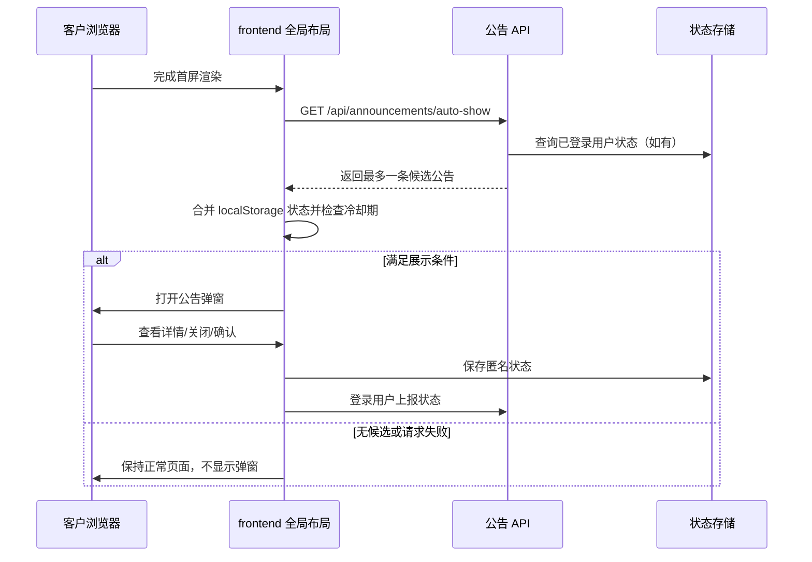
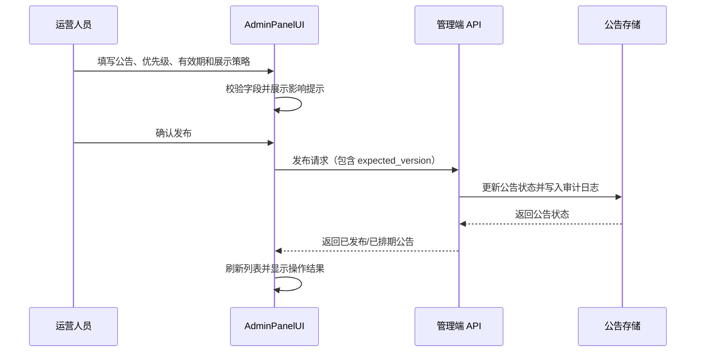

# 公告模块设计方案

> 文档类型：产品与技术设计（仅文档，不涉及实际代码）
> 适用范围：ShopMall 管理后台 `AdminPanelUI/`、客户前台 `frontend/`、现有 Spring/Kotlin 后端
> 文档日期：2026-08-11
> 状态：已按方案完成首期实现（2026-08-11）

## 1. 背景与目标

ShopMall 当前没有统一的公告领域模块。客户前台登录页和注册页存在静态的 `announcement-bar`，但公告内容无法由运营人员统一管理，也不能沉淀公告历史或控制公告是否在网站加载完成后主动弹出。

本模块用于管理面向客户的站内公告，满足以下核心需求：

1. 管理员可以创建、编辑、发布、下线和归档公告。
2. 每条公告可以设置优先级，前台按照优先级决定展示顺序。
3. 管理员和客户都可以查看历史公告；客户只看到允许公开的历史版本/公告。
4. 管理员可以决定某条公告是否在客户网站加载完成后主动展示。
5. 主动展示应避免对用户造成重复打扰，并支持关闭、稍后处理和再次展示策略。
6. 公告内容、发布时间、有效期和展示策略具备明确的状态约束，避免过期公告继续展示。
7. 设计与现有项目职责保持一致：管理功能放在 `AdminPanelUI/`，客户展示和历史页面放在 `frontend/`。

## 2. 范围与非目标

### 2.1 本期范围

- 公告 CRUD 与状态管理。
- 优先级设置与前台排序。
- 公告发布、定时生效、定时失效。
- 客户端公告列表、公告详情和历史公告。
- 网站加载完成后的主动展示。
- 客户关闭/已读状态的本地记录与登录用户的服务端记录。
- 基础查询、筛选、分页和操作审计。

### 2.2 暂不纳入本期

- 邮件、短信、推送通知和浏览器 Push。
- 按用户标签、地区、会员等级或订单状态定向投放。
- 富文本图片上传、视频托管和复杂页面编辑器；首期可采用受限 Markdown 或安全 HTML 子集，具体实现由开发阶段评估。
- 多语言翻译工作流。数据模型预留语言扩展，但本期默认一种语言。
- 数据库迁移脚本。根据项目约定，数据库迁移不在本设计实施范围内；本文只描述逻辑数据模型。

## 3. 角色与使用场景

| 角色 | 主要能力 |
| --- | --- |
| 管理员/运营人员 | 创建草稿、编辑内容、设置优先级与有效期、开启/关闭主动展示、发布与下线、查看历史与操作记录 |
| 未登录客户 | 查看公开公告、查看公告详情和历史公告；浏览器本地保存关闭/已读状态 |
| 已登录客户 | 拥有未登录客户全部能力；公告已读和关闭状态可同步到服务端 |
| 系统任务 | 根据生效时间和失效时间自动判定公告是否处于可展示状态，不直接替代人工发布 |

## 4. 核心概念

### 4.1 公告状态

建议使用以下状态：

| 状态 | 含义 | 是否可编辑 | 是否面向客户展示 |
| --- | --- | --- | --- |
| `DRAFT` 草稿 | 尚未发布，内容可继续编辑 | 是 | 否 |
| `SCHEDULED` 已排期 | 已发布但未来才生效 | 受限编辑，修改需重新确认排期 | 否 |
| `PUBLISHED` 已发布 | 已到生效时间且未到失效时间 | 受限编辑，重要字段修改需二次确认 | 是，按展示条件 |
| `OFFLINE` 已下线 | 被管理员主动停止展示 | 是，可重新排期或再次发布 | 否 |
| `EXPIRED` 已过期 | 已超过失效时间 | 只读或复制为新公告 | 否 |
| `ARCHIVED` 已归档 | 历史留存，不再参与运营 | 否，建议复制创建新公告 | 否；是否出现在客户历史页由公开标记决定 |

状态不是单纯的前台查询结果。前台还必须结合 `published_at`、`effective_from`、`effective_until`、公开标记和渠道配置计算“当前是否可展示”。

### 4.2 公告类型

首期建议支持：

- `GENERAL`：常规站内公告。
- `IMPORTANT`：重要公告，适合服务变更、配送政策变化等。
- `MAINTENANCE`：系统维护、服务中断或恢复通知。
- `PROMOTION`：营销活动公告。

类型用于筛选、视觉样式和默认策略，不替代优先级。管理员仍可以为每条公告单独设置优先级。

### 4.3 优先级

采用整数优先级，范围建议为 `0..100`：

- `80..100`：紧急/关键公告。
- `50..79`：重要公告。
- `20..49`：普通公告。
- `0..19`：低优先级或补充信息。

排序规则：

1. 优先级降序。
2. `effective_from` 降序，较新的公告优先。
3. `published_at` 降序。
4. `id` 降序作为稳定的最终排序。

优先级只影响同一展示位置/同一渠道内的顺序，不会让未生效、已下线或已过期公告被展示。

### 4.4 主动展示

“主动展示”表示客户网站完成首屏加载后，由前台主动打开公告弹窗或公告抽屉，而不是等待用户点击公告入口。

建议将主动展示拆成三个独立概念：

- `auto_show_enabled`：该公告是否允许主动展示。
- `auto_show_mode`：每个浏览器一次、每个公告一次、每个周期一次或每次加载均展示。
- `auto_show_cooldown_hours`：关闭或跳过后的再次展示冷却时间。

这样可以避免只用一个布尔值表达复杂的重复展示行为。

## 5. 产品功能设计

## 5.1 管理后台

新增导航项：`公告管理`，建议路径：`/announcements`。

### 列表页

列表页支持：

- 按标题关键字搜索。
- 按状态筛选。
- 按公告类型筛选。
- 按是否主动展示筛选。
- 按发布时间、生效时间、失效时间筛选。
- 按优先级、更新时间、发布时间排序。
- 分页查看。
- 批量下线、归档；批量发布需二次确认。

列表建议字段：

| 字段 | 说明 |
| --- | --- |
| 标题 | 公告标题，过长时截断并支持详情查看 |
| 类型 | 常规、重要、维护、促销 |
| 优先级 | `0..100`，显示数值和等级标签 |
| 状态 | 草稿、已排期、已发布、已下线、已过期、已归档 |
| 主动展示 | 开/关 |
| 生效时间 | ISO-8601 `LocalDateTime` |
| 失效时间 | 可为空，表示不设自动失效 |
| 更新时间 | 最近修改时间 |
| 操作 | 查看、编辑、发布/下线、归档、复制 |

### 创建/编辑页

必填字段：

- 标题：建议 1 至 120 个字符。
- 摘要：建议不超过 255 个字符，用于列表、通知条和 SEO/预览。
- 正文：建议不超过 20,000 个字符。
- 公告类型。
- 优先级。
- 生效时间。

可选字段：

- 失效时间。
- 是否公开显示在历史公告中。
- 是否允许主动展示。
- 主动展示模式。
- 主动展示冷却时间。
- 点击公告后的站内路由或受信任的站外链接。
- 展示位置：顶部公告条、首页弹窗、全站弹窗、公告中心。首期建议固定为“公告中心 + 全站弹窗”，保留字段扩展能力。

校验规则：

1. 标题、摘要和正文去除首尾空白后不可为空。
2. 优先级必须为 `0..100` 的整数。
3. `effective_until` 为空或必须晚于 `effective_from`。
4. 主动展示开启时，公告必须设置为公开且必须有可展示正文。
5. 失效公告不能再次直接编辑为已发布；应修改后重新确认发布时间，或复制为新公告。
6. 已发布公告修改标题、正文、优先级、主动展示策略或有效期时，后台必须提示“修改会影响当前客户展示”。
7. 站外链接仅允许 `https`；不允许注入 `javascript:`、`data:` 等协议。

### 发布与下线

发布确认需要显示：标题、优先级、生效时间、失效时间、主动展示策略和预计影响范围。

- 生效时间早于或等于当前时间：发布后进入 `PUBLISHED`。
- 生效时间晚于当前时间：发布后进入 `SCHEDULED`。
- 主动展示开启的高优先级公告必须再次确认，避免误操作造成全站弹窗。
- 下线后立即不再出现在前台当前公告接口中。
- 下线不删除数据，仍保留历史和操作记录。

## 5.2 客户前台

### 公告入口

在客户前台全局布局中增加公告入口，建议包括：

1. 顶部公告条：展示当前最高优先级的一条摘要；无公告时不占位。
2. 公告中心入口：展示当前公告数量或未读数量。
3. 公告中心页面：查看当前公告和历史公告。
4. 公告详情：查看完整正文、发布时间和有效期。
5. 主动展示弹窗：仅在规则满足时触发。

当前项目的 `frontend/app/app.vue` 只负责包裹 `NuxtPage`，因此全局公告条、公告弹窗和加载完成后的拉取逻辑应设计为布局级能力，而不是分别复制到各个页面。

### 历史公告

建议路由：

- `/announcements`：当前公告与历史公告列表。
- `/announcements/:id`：公告详情。

历史公告页面默认按发布时间倒序，支持按年份或类型筛选。已下线、已过期且标记为公开历史的公告仍可查看；草稿、未公开公告、管理员删除/归档但未公开的公告不可被客户查询。

客户端可见字段：

- 标题。
- 摘要。
- 正文。
- 公告类型。
- 发布时间。
- 生效时间和失效时间（如产品希望对外透明）。
- 是否已读由客户端自行计算，不必作为公告内容返回。

### 主动展示交互

默认建议：

- 网站完成首屏加载并完成公告接口请求后再展示，避免阻塞页面渲染。
- 同一时刻最多主动弹出一条公告。
- 选取当前满足条件且优先级最高的公告。
- 弹窗提供“查看详情”“关闭”两个动作；重要公告可提供“我已知晓”。
- 用户关闭后按公告 ID 记录状态，在冷却期内不再次弹出。
- 用户点击“查看详情”视为已读，并不自动关闭其他公告。
- 弹窗失败、接口超时或内容加载失败不得阻塞网站正常使用。
- 用户开启浏览器减少动态效果时，使用无动画或静态公告条替代动画弹窗。

## 6. 主动展示规则

### 6.1 展示资格

某条公告只有同时满足以下条件才能主动展示：

```text
status = PUBLISHED
且当前时间 >= effective_from
且 effective_until 为空或当前时间 < effective_until
且 active = true
且 auto_show_enabled = true
且当前渠道包含 CUSTOMER_WEB
且当前用户/浏览器不在该公告的冷却或已处理范围内
```

服务端返回的“待主动展示公告”必须已经完成状态和时间过滤，前台不得仅依赖 `auto_show_enabled` 判断。

### 6.2 匿名用户与登录用户

- 匿名用户：使用浏览器 `localStorage` 记录公告状态。建议 key 为版本化命名空间，例如 `shopmall.announcements.v1`；只保存公告 ID、状态和时间，不保存正文。
- 登录用户：以用户 ID 与公告 ID 记录已读/关闭/跳过状态，服务端返回时过滤已处理公告。
- 登录前后状态合并：登录成功后，前台将匿名状态作为候选上报；服务端只允许写入公告已存在且用户可见的状态，避免客户端伪造不存在的公告。
- 不应使用 IP 作为用户状态主键；移动网络、共享网络和隐私代理会造成误判。

### 6.3 重复展示策略

首期默认策略建议：`ONCE_PER_ANNOUNCEMENT`。

| 模式 | 触发规则 | 适用场景 |
| --- | --- | --- |
| `ONCE_PER_ANNOUNCEMENT` | 用户关闭、已知晓或查看详情后不再主动展示 | 普通公告 |
| `ONCE_PER_BROWSER_SESSION` | 当前浏览器会话最多展示一次 | 临时提醒 |
| `COOLDOWN` | 关闭后经过冷却时间可再次展示 | 持续维护提醒 |
| `EVERY_LOAD` | 每次加载满足条件都展示 | 不建议默认使用，仅限极端重要公告 |

`EVERY_LOAD` 必须受到服务端或管理端权限约束，避免因配置错误形成无法关闭的弹窗。

### 6.4 多条公告竞争

接口可返回候选公告列表，但前台只自动展示第一条。排序采用：

1. 优先级降序。
2. 公告类型权重降序：`MAINTENANCE`/`IMPORTANT` 高于 `GENERAL`/`PROMOTION`；类型权重只作为同优先级时的辅助排序。
3. 生效时间降序。
4. 公告 ID 降序。

主动弹窗关闭后，本次页面加载不自动连续弹出下一条，避免连续打断用户。用户可在公告中心继续查看其他公告。

## 7. 逻辑数据模型

> 以下为逻辑模型，不是数据库迁移脚本。实现时应遵循项目既有持久化方式，并使用 `LocalDateTime` 作为业务时间字段。

### 7.1 `Announcement`

| 字段 | 类型/约束 | 说明 |
| --- | --- | --- |
| `id` | `Long`，主键 | 公告 ID |
| `title` | `String`，1-120 | 标题 |
| `summary` | `String`，1-255 | 摘要 |
| `content` | `String`，最大 20,000 | 正文，存储受限 Markdown 或安全 HTML |
| `type` | 枚举 | `GENERAL`、`IMPORTANT`、`MAINTENANCE`、`PROMOTION` |
| `priority` | `Int`，0-100 | 优先级 |
| `status` | 枚举 | 生命周期状态 |
| `published` | `Boolean` | 是否已执行发布动作；与状态配合使用 |
| `public_history` | `Boolean` | 是否允许客户在历史公告中查看 |
| `auto_show_enabled` | `Boolean` | 是否允许网站加载后主动展示 |
| `auto_show_mode` | 枚举 | 主动展示频率 |
| `auto_show_cooldown_hours` | `Int?` | 冷却小时数，`COOLDOWN` 时必填 |
| `channel` | 枚举/集合 | 首期至少支持 `CUSTOMER_WEB` |
| `effective_from` | `LocalDateTime` | 生效时间 |
| `effective_until` | `LocalDateTime?` | 失效时间，空表示不自动失效 |
| `published_at` | `LocalDateTime?` | 发布动作发生时间 |
| `created_by` | `Long` | 创建管理员 ID |
| `updated_by` | `Long` | 最近修改管理员 ID |
| `created_at` | `LocalDateTime` | 创建时间 |
| `updated_at` | `LocalDateTime` | 更新时间 |
| `archived_at` | `LocalDateTime?` | 归档时间 |
| `version` | `Long` | 乐观锁版本，防止后台覆盖他人修改 |

建议不物理删除公告。若确有合规删除需求，应增加明确的删除权限、原因和审计记录，并保留不可变操作日志。

### 7.2 `AnnouncementUserState`

用于登录用户的已读、关闭和跳过记录：

| 字段 | 类型/约束 | 说明 |
| --- | --- | --- |
| `id` | `Long`，主键 | 记录 ID |
| `announcement_id` | `Long` | 公告 ID |
| `user_id` | `Long` | 客户用户 ID |
| `state` | 枚举 | `SEEN`、`DISMISSED`、`ACKNOWLEDGED` |
| `first_seen_at` | `LocalDateTime` | 首次查看时间 |
| `last_seen_at` | `LocalDateTime` | 最近查看时间 |
| `dismissed_at` | `LocalDateTime?` | 关闭时间 |
| `acknowledged_at` | `LocalDateTime?` | 确认时间 |
| `created_at` | `LocalDateTime` | 创建时间 |
| `updated_at` | `LocalDateTime` | 更新时间 |

在 `announcement_id + user_id` 上建立唯一约束。若后续需要记录每次展示事件，再拆分展示事件表，不要让状态表无限增长。

### 7.3 `AnnouncementAuditLog`

用于记录公告管理动作：

| 字段 | 类型/约束 | 说明 |
| --- | --- | --- |
| `id` | `Long`，主键 | 日志 ID |
| `announcement_id` | `Long` | 公告 ID |
| `operator_id` | `Long` | 操作管理员 ID |
| `action` | 枚举 | 创建、编辑、发布、下线、归档、复制、恢复等 |
| `before_snapshot` | JSON/文本 | 操作前关键字段快照 |
| `after_snapshot` | JSON/文本 | 操作后关键字段快照 |
| `reason` | String? | 下线或特殊修改原因 |
| `created_at` | `LocalDateTime` | 操作时间 |

审计日志只追加不更新。内容快照可以只保留标题、摘要、正文哈希、优先级、状态和展示策略，避免重复存储大正文；如运营确实需要版本回溯，再单独引入版本表。

## 8. 服务端接口设计

> 以下是接口契约草案。具体 Controller 实现必须遵循 `docs/CONTROLLER_CONVENTIONS.md` 和项目既有 Controller 风格：输入直接声明在 endpoint 参数中，响应数据类声明在 endpoint 方法内，使用 snake_case wire name、`ResponseEntity<shared.Response>` 与注入的 `ResponseBuilder`。本设计不新增请求包装 DTO。

### 8.1 客户端接口

#### 获取当前公告

```http
GET /api/announcements/current
```

用途：获取当前客户可见且处于有效期内的公告，供公告条、公告中心和主动展示候选使用。

建议查询参数：

- `include_read`：是否返回已读公告，默认 `true`；主动展示接口不使用该参数。
- `limit`：默认 20，最大 50。

响应核心字段：

```json
{
  "items": [
    {
      "id": 101,
      "title": "配送服务调整通知",
      "summary": "部分地区配送时效将在维护期间调整。",
      "content": "...",
      "type": "MAINTENANCE",
      "priority": 90,
      "published_at": "2026-08-11T09:00:00",
      "effective_from": "2026-08-11T09:00:00",
      "effective_until": "2026-08-12T09:00:00",
      "is_read": false,
      "auto_show_enabled": true
    }
  ]
}
```

`auto_show_enabled` 可以返回给前台用于展示决策，但服务端必须已经过滤掉不符合主动展示资格的公告。若希望减少客户端耦合，可将其改为专用的 `GET /api/announcements/auto-show` 接口。

#### 获取主动展示候选

```http
GET /api/announcements/auto-show
```

用途：网站加载完成后调用，只返回最多一条当前可主动展示公告。

服务端应根据匿名请求或登录用户身份过滤：状态、有效期、渠道、主动展示开关、用户处理状态和冷却时间。接口为空时返回空列表或明确的 `null` 数据约定，前台不得将“无数据”视为错误。

#### 获取公告详情

```http
GET /api/announcements/{id}
```

只允许访问当前公开公告，或状态为已下线/已过期/已归档且 `public_history = true` 的历史公告。

#### 获取历史公告

```http
GET /api/announcements/history?page=0&size=20&type=GENERAL
```

建议支持：

- `page`：从 0 开始。
- `size`：默认 20，最大 50。
- `type`：公告类型，可选。
- `year`：按公告发布年份筛选，可选。
- `keyword`：仅对标题和摘要搜索，可选。

历史接口必须分页，不能一次返回全部历史正文。列表页只返回摘要；详情页再返回正文。

#### 上报客户状态

```http
POST /api/announcements/{id}/state?state=SEEN
```

可选状态：`SEEN`、`DISMISSED`、`ACKNOWLEDGED`。

- 匿名用户可以不上报服务端，直接使用浏览器本地状态。
- 已登录用户上报后使用幂等写入；重复 `SEEN` 不应产生错误。
- 服务端校验公告仍存在且对该用户公开。
- 记录状态不应影响公告历史详情的访问权限。

### 8.2 管理端接口

建议统一前缀：`/admin/api/announcements`。

| 方法 | 路径 | 用途 |
| --- | --- | --- |
| `GET` | `/admin/api/announcements` | 分页查询公告，支持状态、类型、优先级、主动展示和时间筛选 |
| `POST` | `/admin/api/announcements` | 创建公告草稿 |
| `GET` | `/admin/api/announcements/{id}` | 查看公告详情和操作摘要 |
| `PUT` | `/admin/api/announcements/{id}` | 编辑草稿或允许编辑的已发布公告 |
| `POST` | `/admin/api/announcements/{id}/publish` | 发布/排期公告 |
| `POST` | `/admin/api/announcements/{id}/offline` | 下线公告，建议必填原因 |
| `POST` | `/admin/api/announcements/{id}/archive` | 归档公告 |
| `POST` | `/admin/api/announcements/{id}/copy` | 复制为新草稿 |
| `GET` | `/admin/api/announcements/{id}/audit-logs` | 查看公告操作历史 |

管理端列表查询参数建议：

- `page`、`size`。
- `keyword`。
- `status`、`type`。
- `priority_min`、`priority_max`。
- `auto_show_enabled`。
- `effective_from_start`、`effective_from_end`。
- `sort_by`、`sort_direction`。

发布接口应接收 `expected_version`，更新接口也应支持乐观锁版本。版本冲突返回 `409 Conflict`，响应中给出当前版本号，前台提示管理员刷新后重新编辑，不得静默覆盖。

## 9. 前后台展示流程

### 9.1 客户网站加载流程



前台应在 `onMounted` 或等效的客户端生命周期中触发主动展示查询，不应在 SSR 阶段直接访问 `window` 或 `localStorage`。请求应设置超时或复用项目现有 HTTP 客户端的错误处理。

### 9.2 管理员发布流程



## 10. 缓存与一致性

### 10.1 推荐策略

- 当前公告和主动展示候选是低频变更、高频读取数据，可使用短 TTL 缓存。
- 缓存 key 至少区分接口用途和渠道，例如 `announcements:customer-web:current`、`announcements:customer-web:auto-show`。
- 公告发布、编辑、下线、归档后立即删除相关缓存；不依赖 TTL 等待生效。
- 用户已读/关闭状态不建议进入公共公告缓存。公共缓存只缓存公告候选，用户状态在请求阶段过滤。
- 若公共缓存包含“是否已读”，必须按用户维度缓存，首期不建议这么做。

### 10.2 一致性要求

1. 下线后的公告不得继续作为主动展示候选返回。
2. 新发布的高优先级公告应在缓存失效后可见，目标是秒级而非强一致事务跨缓存保证。
3. 发布与审计日志写入应处于同一业务事务内。
4. 用户状态写入失败不能阻塞详情查看；前台可保留本地状态并稍后重试。
5. 多实例部署时，缓存失效应通过现有消息/缓存协调机制广播；若项目尚未使用该机制，首期可采用短 TTL + 每次管理操作主动删除本实例缓存，并在实现阶段补充跨实例方案。

## 11. 权限、安全与内容治理

### 11.1 权限

- 客户接口只允许访问公开公告。
- 管理端所有写操作要求管理员身份和相应权限。
- “发布重要公告/开启每次加载弹窗”可单独要求更高权限；若项目暂不区分细粒度角色，至少保留审计记录和二次确认。
- 管理员不能通过客户端状态接口修改其他用户状态。

### 11.2 内容安全

- 正文不直接渲染未经清洗的 HTML。
- 若支持 Markdown，服务端应限制链接协议、标签、属性和内联样式，并在前台渲染前再次遵循统一安全策略。
- 所有外链只允许 `https`，必要时使用 `rel="noopener noreferrer"`。
- 标题和摘要按纯文本输出，避免 HTML 注入。
- 公告内容长度、请求体大小和列表分页大小必须有上限。

### 11.3 审计

以下动作必须记录：创建、编辑、发布、修改优先级、开启/关闭主动展示、下线、归档、复制和恢复。审计记录应包含管理员 ID、时间、动作、版本和关键变更前后值。

## 12. 错误处理与降级

| 场景 | 服务端行为 | 前台/后台行为 |
| --- | --- | --- |
| 公告不存在 | `404` | 客户显示“公告不存在或已下线”；后台刷新列表 |
| 无权访问 | `403` 或按公开资源返回 `404` | 不泄露未公开公告存在性 |
| 版本冲突 | `409` 并返回当前版本 | 提示刷新，禁止覆盖他人修改 |
| 参数校验失败 | `400` | 显示对应字段错误 |
| 主动展示接口超时 | 不影响其他 API | 不弹窗，保留公告入口 |
| 状态上报失败 | 返回明确错误或稍后重试 | 本地先记录，后台重试；不阻塞用户阅读 |
| 正文渲染失败 | 返回安全纯文本/摘要 | 使用摘要或纯文本降级展示 |

## 13. 测试设计

### 13.1 后端单元测试

- 优先级和稳定排序正确。
- 未生效、已过期、已下线、未公开公告不会进入客户当前接口。
- `effective_until` 边界正确：当前时间等于失效时间时不再展示。
- 主动展示只返回 `auto_show_enabled = true` 的公告。
- `ONCE_PER_ANNOUNCEMENT`、`COOLDOWN` 等策略过滤正确。
- 匿名请求和登录用户请求的状态过滤正确。
- 重复状态上报幂等。
- 发布、下线、归档写入审计记录。
- `expected_version` 冲突返回 `409`，不覆盖数据库现有内容。
- 站外链接协议和正文内容校验正确。

### 13.2 Controller/API 测试

- 客户端只能访问公开当前公告和公开历史公告。
- 管理端接口需要管理员认证。
- 请求参数使用 snake_case wire name。
- 时间字段使用 ISO-8601 `LocalDateTime` 格式，例如 `2026-08-11T09:00:00`。
- 列表分页、筛选、排序和最大 `size` 生效。
- 错误响应遵循现有 `ResponseBuilder` 和统一响应结构。

### 13.3 前端测试

- 网站加载完成后调用主动展示接口，而非 SSR 阶段调用浏览器 API。
- 接口失败时网站仍可正常浏览。
- 关闭、查看详情、确认后状态正确写入本地存储。
- 登录用户状态上报失败时不阻塞公告详情。
- 同一页面加载最多弹出一条公告。
- 历史公告列表分页和详情跳转正确。
- 低宽度屏幕、键盘操作、焦点管理和 ESC 关闭行为正确。
- `prefers-reduced-motion` 下不播放弹窗动画。

### 13.4 验收场景

1. 管理员创建一条优先级 90、立即生效、开启主动展示的维护公告；客户完成网站加载后看到弹窗。
2. 客户关闭公告后刷新页面，默认不再次弹出；公告中心仍可打开该公告。
3. 管理员将公告下线；下线后新页面加载不再弹窗，历史页仍可见（若公开历史）。
4. 管理员创建未来生效公告；在生效前客户看不到，生效后无需重新发布即可进入当前公告。
5. 两条公告同时有效时，优先级高者主动弹出，公告中心按优先级排序。
6. 管理员修改公告时遇到版本冲突，系统提示刷新，不丢失其他管理员的修改。
7. 主动展示接口不可用时，网站其他功能仍正常工作。

## 14. 可观测性与运营指标

建议记录以下指标，但不将指标采集作为公告业务成功的前置条件：

- 当前公告接口请求量、成功率、P95 延迟。
- 主动展示候选数量。
- 弹窗展示次数。
- 关闭、已知晓、查看详情次数。
- 公告点击率和已读率。
- 按公告 ID、类型和优先级统计的展示/交互数据。
- 公告接口异常、正文安全清洗失败和状态上报失败次数。

指标中不应记录不必要的正文内容、完整用户隐私信息或支付信息。用户状态和行为数据应按项目隐私政策保留和清理。

## 15. 分阶段交付建议

### Phase 1：最小可用版本

- 管理后台公告列表、创建/编辑草稿、发布、下线。
- 公告类型、优先级、生效时间、失效时间。
- 客户公告条、公告中心和详情页。
- 网站加载完成后主动展示一次。
- 匿名用户 localStorage 关闭状态。
- 基础权限、校验和审计日志。

### Phase 2：完善运营能力

- 登录用户服务端已读/关闭状态。
- 定时排期和自动过期状态展示。
- 冷却周期、公告确认和未读数量。
- 管理端历史版本和操作日志详情。
- Redis/多实例缓存失效协调。

### Phase 3：定向与多语言

- 多语言公告内容。
- 按用户属性、区域和渠道定向。
- 展示频控、实验分组和转化统计。
- 站内公告与邮件/推送编排。

## 16. 待确认事项

1. 公告正文首期采用受限 Markdown、纯文本还是安全 HTML 子集？
2. 客户历史公告是否允许显示完整正文，还是仅显示摘要？
3. 管理员角色是否需要拆分“编辑”和“发布”权限？
4. 主动展示默认策略是否确定为“每条公告一次”？
5. 重要/维护公告是否需要强制用户点击“我已知晓”？
6. 公告是否需要在登录页、注册页显示；若需要，是否与全站公告条共用同一接口？
7. 公告是否需要支持多语言和按国家/地区筛选？
8. 是否需要把公告点击统计纳入现有日志/指标系统？

## 17. 设计结论

公告模块应以“公告内容 + 生命周期 + 优先级 + 客户处理状态 + 管理审计”为核心，而不是只增加一个前台静态文本。推荐将主动展示作为服务端筛选、前台加载后触发和客户端去重三层共同负责：

- 服务端保证只返回当前有资格展示的公告。
- 前台保证加载完成后非阻塞地展示，并最多弹出一条。
- 客户端保证匿名用户关闭/已读后的重复抑制，登录用户再同步服务端状态。
- 管理后台保证优先级、有效期、发布状态和主动展示开关可审计、可回溯。

该方案已完成 Kotlin 后端、管理端 Vue、客户前台 Vue 与自动化测试的首期实现；遵循项目约定，未创建或修改数据库迁移脚本。
