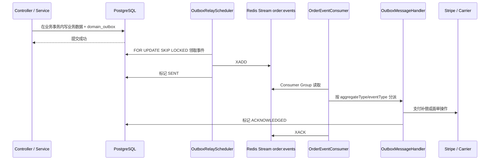
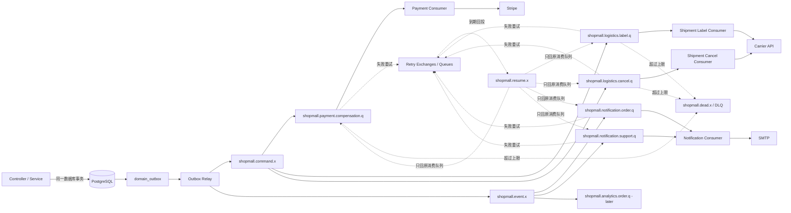

# ShopMall 消息队列解耦设计方案

> 方案日期：2026-08-08  
> 目标：在不破坏现有订单、支付和物流事务正确性的前提下，引入独立消息代理，降低业务服务与外部系统、通知模块及后续数据处理模块之间的同步耦合。

## 1. 结论先行

ShopMall 不是从零开始引入异步机制。项目已经具备一套可工作的雏形：

1. 业务事务通过 `DomainEventPublisher` 将事件写入 PostgreSQL 的 `domain_outbox`；
2. `OutboxRelayScheduler` 定时将事件投递到 Redis Stream `order:events`；
3. `OrderEventConsumer` 使用单一消费组读取消息；
4. `OutboxMessageHandler` 再分派到支付补偿或物流面单处理器；
5. 支付侧已经使用 Stripe 幂等键，物流侧已经使用状态机和条件更新降低重复消费风险。

因此，本方案不建议在 Controller 或 Service 中直接新增一次“业务事务内发 RabbitMQ”的调用，也不建议删除现有 Outbox。推荐目标是：

- **保留 PostgreSQL Transactional Outbox，保证业务数据与待投递消息同事务提交；**
- **将 Redis Streams 传输层分阶段替换为 RabbitMQ；**
- **把“命令队列”和“领域事件广播”拆开；**
- **采用至少一次投递，不宣称 Exactly Once；**
- **通过业务状态机、第三方幂等键和消费者去重保证重复消息安全；**
- **首期先迁移现有支付补偿与远程面单任务，再引入订单/工单通知等扇出消费者；**
- **API 应用与消费者可先部署在同一进程，稳定后再拆成独立 Worker，不要求首期微服务化。**

技术选型建议：**RabbitMQ**。当前场景主要是中低吞吐、强路由、可靠任务执行、延迟重试和死信处理，RabbitMQ 比 Kafka 更贴近需求；相较继续共用 Redis，也能把消息积压与缓存、验证码、限速、登录和幂等键的故障域隔离开。

本方案不创建或修改数据库迁移脚本。首期实现复用现有 `domain_outbox` 字段；若后续需要通用、持久化的消费者 Inbox/去重表，应另开明确的数据模型实施范围。

## 2. 当前实现与可复用能力

### 2.1 当前链路



相关代码：

- `src/main/kotlin/top/foxball/shopmall/entity/jdbc/OutboxEvent.kt`
- `src/main/kotlin/top/foxball/shopmall/repository/OutboxEventRepository.kt`
- `src/main/kotlin/top/foxball/shopmall/service/DomainEventPublisher.kt`
- `src/main/kotlin/top/foxball/shopmall/service/impl/OutboxRelayScheduler.kt`
- `src/main/kotlin/top/foxball/shopmall/service/impl/OrderEventConsumer.kt`
- `src/main/kotlin/top/foxball/shopmall/service/impl/OutboxMessageHandler.kt`
- `src/main/kotlin/top/foxball/shopmall/service/impl/ShipmentOutboxProcessor.kt`
- `src/main/kotlin/top/foxball/shopmall/service/impl/OrderPaymentServiceImpl.kt`

### 2.2 应继续保留的能力

- 订单、运单状态和 Outbox 同事务写入；
- Outbox 批量领取使用 `FOR UPDATE SKIP LOCKED`，支持多实例竞争；
- 支付退款使用稳定的 Stripe 幂等键；
- 同一支付资源通过 Redis 锁降低并发补偿；
- 运单远程调用前后拆分事务，避免持有数据库事务等待承运商网络请求；
- 运单状态通过条件更新和状态机阻止非法跳转；
- 失败重试、退避、死信和人工重放已经有初步状态定义。

### 2.3 当前实现的扩展瓶颈

1. `order:events` 同时承载订单和运单消息，名称与职责不一致。
2. 当前只有一个消费组和一个总分派器；如果通知、统计、审计都需要收到同一订单事件，必须继续向一个巨大 `when` 分支叠加逻辑，或者为 Redis Stream 额外设计多个消费组。
3. `OutboxEvent.status` 同时表达“已送达消息代理”和“业务消费者已处理”，不适用于一个事件被多个独立消费者订阅的扇出场景。
4. Relay 与 Consumer 直接依赖 `StringRedisTemplate`，业务消息模型和传输实现没有隔离。
5. Redis 同时承载验证码、限速、认证、业务幂等、日志设置与 Stream；消息积压或 Redis 运维动作会扩大故障面。项目中的 `RedisCleanupConfig` 还支持 `flushDb`，生产环境虽然应关闭，但消息基础设施不应依赖这一约束维持安全。
6. 事件名是散落在 Service 中的字符串，Payload 多处手工拼接 JSON，缺少统一版本、消息 ID、因果关系和请求关联字段。
7. 当前 Stream 使用近似 `MAXLEN` 裁剪；容量设置不当会让消息保留与消费积压互相影响。
8. 消费器与 API 同进程、同调度器体系运行，外部服务慢调用、积压处理和 Web 请求资源仍存在相互影响。
9. 目前未知事件会被总处理器忽略后确认，不能尽早发现拼写、版本或路由错误。

## 3. 解耦范围与边界

### 3.1 第一优先级：迁移已有异步命令

这些场景已经具备异步语义，最适合低风险切换消息代理：

| 当前事件 | 目标消息 | 消费者 | 说明 |
| --- | --- | --- | --- |
| `PAYMENT_CANCEL_OR_REFUND` | `cmd.payment.cancel-or-refund.v1` | 支付补偿 Worker | 取消 Checkout Session，必要时退款 |
| `PAYMENT_CONFLICT_REFUND` | `cmd.payment.conflict-refund.v1` | 支付补偿 Worker | 已取消订单收到成功支付后的冲突退款 |
| `SHIPMENT_LABEL_REQUESTED` | `cmd.shipment.create-label.v1` | 物流面单 Worker | 调用承运商创建远程面单 |
| `SHIPMENT_CANCEL_REQUESTED` | `cmd.shipment.cancel-label.v1` | 物流取消 Worker | 调用承运商取消远程面单并释放分配 |

### 3.2 第二优先级：增加领域事件扇出

RabbitMQ 稳定后，再让以下状态变化驱动多个互不依赖的消费者：

| 领域事件 | 推荐路由键 | 可订阅模块 |
| --- | --- | --- |
| 订单创建 | `evt.order.created.v1` | 客户通知、运营审计 |
| 支付成功 | `evt.order.paid.v1` | 客户通知、履约准备、统计 |
| 订单取消 | `evt.order.cancelled.v1` | 客户通知、运营审计 |
| 支付超时 | `evt.order.timed-out.v1` | 客户通知、转化漏斗统计 |
| 订单发货 | `evt.order.shipped.v1` | 客户通知、统计 |
| 订单签收 | `evt.order.delivered.v1` | 客户通知、评价邀请 |
| 面单创建 | `evt.shipment.label-created.v1` | 仓储/运营通知 |
| 运单发出 | `evt.shipment.dispatched.v1` | 订单通知、统计 |
| 运单取消 | `evt.shipment.cancelled.v1` | 运营通知 |
| 工单创建 | `evt.support-ticket.created.v1` | 管理员通知 |
| 工单新增消息 | `evt.support-ticket.message-added.v1` | 客户或管理员通知 |

只有在至少一个实际消费者和对应队列已经就绪后，才启用某个领域事件的 RabbitMQ 路由。首期不要把大量无人消费的事件直接发送到交换机后当作“成功解耦”。

### 3.3 保持同步的业务

以下业务仍由当前请求事务同步完成：

- 下单参数校验、用户/地址校验；
- 商品价格快照、库存扣减、库存回补；
- 订单和运单状态的权威写入；
- 获取 Stripe Checkout URL，因为 HTTP 响应必须返回跳转地址；
- Stripe/物流 Webhook 的签名校验、大小限制和最小幂等接收；
- 登录、刷新令牌、验证码校验；
- 必须立即向调用方明确返回成功或失败的管理操作。

原则是：**队列承载“事务提交后的后续动作”和“可最终一致的副作用”，不承载订单核心不变量。**

### 3.4 暂不异步化验证码邮件

验证码发送当前需要向调用方明确报告 SMTP 失败，并且验证码属于敏感数据。首期保持同步，原因包括：

- 改成异步后，HTTP 成功只能表示“已排队”，不能表示用户会收到邮件；
- 验证码进入 Broker 会增加秘密数据的存储和运维暴露面；
- 发送锁、每日限额、IP 限额和验证码有效期需要重新定义“排队成功”和“发送成功”的记账时点。

若后续 SMTP 延迟确实影响接口，可单独设计加密的验证码发送命令、投递状态查询和失败补发，不与普通订单通知共用队列。

## 4. 技术选型

| 维度 | Redis Streams | RabbitMQ | Kafka |
| --- | --- | --- | --- |
| 当前接入成本 | 最低，项目已经使用 | 中等，新增独立组件 | 最高 |
| 任务队列/工作分发 | 可实现 | 原生适合 | 可实现，但模型偏日志流 |
| Topic 路由与扇出 | 需设计多个消费组 | Exchange + Queue 清晰 | Topic + Consumer Group 清晰 |
| 延迟重试与死信 | 需自行维护 Pending/重投 | TTL/DLX/队列策略成熟 | 通常需要重试 Topic 和额外编排 |
| 单消息确认 | 有 XACK/Pending | Consumer Ack | Offset 提交 |
| 长期事件回放 | 一般 | 不是主要优势 | 最强 |
| 运维复杂度 | 低，但与现有 Redis 共故障域 | 中等 | 高 |
| ShopMall 当前匹配度 | 可作为过渡 | **最高** | 暂无必要 |

最终选择：

- **业务命令和领域事件：RabbitMQ；**
- **Redis：继续用于验证码、限速、认证、短期幂等和缓存，不再作为最终业务消息总线；**
- **Kafka：仅在未来出现大规模行为流、日志流、CDC 或长周期回放需求时重新评估。**

## 5. 目标架构



### 5.1 部署形态

第一阶段不强制拆微服务：

- API、Relay 和 Consumers 仍可在同一个 Spring Boot 应用中；
- 每类消费者用独立 Listener Container 和并发配置隔离；
- 通过配置开关决定一个实例启用 `api`、`relay`、`consumer` 中的哪些角色；
- 稳定后可用同一代码制品部署 API 节点和 Worker 节点，API 节点关闭消费者，Worker 节点关闭 Web 流量或只保留管理端口。

这样先获得业务解耦、积压缓冲和独立扩容能力，再决定是否需要代码仓库或服务级拆分。

## 6. RabbitMQ 拓扑

### 6.1 Exchange

| 名称 | 类型 | 用途 |
| --- | --- | --- |
| `shopmall.command.x` | topic | 一条命令只交给一个业务处理队列 |
| `shopmall.event.x` | topic | 同一领域事件扇出到多个订阅队列 |
| `shopmall.retry.30s.x` | direct | MVP 的 30 秒重试入口；按消费队列的 `queue_route` 定向 |
| `shopmall.retry.5s.x`、`shopmall.retry.5m.x`（后续） | direct | 经实测后启用的分级退避入口；按 `queue_route` 定向 |
| `shopmall.resume.x` | direct | Retry TTL 到期后只回到原消费队列，避免领域事件再次扇出 |
| `shopmall.dead.x` | direct | 按 `queue_route` 将永久失败消息送入对应 DLQ |

所有 Exchange 均持久化，不使用 auto-delete。

### 6.2 Queue

| Queue | 业务 Binding | `queue_route` | 初始并发 | 说明 |
| --- | --- | --- | ---: | --- |
| `shopmall.payment.compensation.q` | `cmd.payment.*.v1` | `payment.compensation` | 1～2 | Stripe 取消/退款补偿 |
| `shopmall.logistics.label.q` | `cmd.shipment.create-label.v1` | `logistics.label` | 1 | 远程创建面单 |
| `shopmall.logistics.cancel.q` | `cmd.shipment.cancel-label.v1` | `logistics.cancel` | 1 | 远程取消面单 |
| `shopmall.notification.order.q` | `evt.order.*.v1` | `notification.order` | 2 | 订单生命周期通知 |
| `shopmall.notification.support.q` | `evt.support-ticket.*.v1` | `notification.support` | 2 | 工单通知 |

每个主 Queue 额外以自己的 `queue_route` 绑定到 `shopmall.resume.x`。对应 Retry Queue（例如 `shopmall.payment.compensation.retry.30s.q`）以同一个 `queue_route` 绑定到 `shopmall.retry.30s.x`，设置 30 秒队列消息 TTL，并将 DLX/Dead Letter Routing Key 分别设为 `shopmall.resume.x` 和该 `queue_route`。主 Queue 则将 DLX 指向 `shopmall.dead.x`，对应 DLQ 同样按 `queue_route` 绑定。

该 1:1 Resume 路由是必要的：某个领域事件订阅 Queue 重试时，只能回到失败的订阅 Queue，不能重新发布到 `shopmall.event.x`，否则已经成功的其他订阅者也会再次收到同一事件。后续增加退避档位时，为每个档位创建独立 Retry Exchange 和对应 Retry Queue，避免同一条消息同时落入多个不同 TTL 的队列。

支付、物流等关键命令主 Queue、Retry Queue 和 DLQ 在生产至少三节点 RabbitMQ 集群中使用 Quorum Queue；本地/单节点测试可以使用 Classic Queue，但不得据此宣称 Broker 高可用。消息设置为 persistent，但要明确：持久化消息和持久化队列不能替代 Publisher Confirm、消费者 Ack 和业务幂等。

### 6.3 顺序

不依赖 RabbitMQ 提供全局严格顺序：

- 支付、运单队列首期低并发，减少同一聚合并行处理；
- 数据库状态机和条件更新仍是权威顺序门闩；
- 同一个运单的创建和取消命令即使乱序，也必须由 `ShipmentStatus` 判定是执行、等待、重试还是安全忽略；
- 扩容后若确实要求同一 `aggregate_id` 串行，可按 `aggregate_id` 哈希到固定分片队列，而不是要求整个系统单线程。

## 7. 消息契约

### 7.1 统一 Envelope

Wire 字段统一使用 snake_case，时间使用项目规定的 `LocalDateTime` 与 `ISO_LOCAL_DATE_TIME`：

```json
{
  "message_id": "outbox:104582",
  "message_kind": "COMMAND",
  "name": "cmd.shipment.create-label",
  "version": 1,
  "aggregate_type": "SHIPMENT",
  "aggregate_id": "8721",
  "occurred_at": "2026-08-08T21:30:12.345",
  "request_id": "2c87c07a-588c-4da2-94a1-0e69282c59fc",
  "causation_id": null,
  "payload": {
    "shipment_id": 8721
  }
}
```

约束：

1. `message_id` 使用稳定的 Outbox ID，如 `outbox:{id}`，重投时保持不变；
2. `name + version` 决定反序列化和处理器，不使用 Java/Kotlin 类名作为外部协议；
3. `aggregate_id` 统一按字符串传输，避免未来 UUID/Long 差异污染通用 Envelope；
4. `occurred_at` 使用稳定配置时区生成 ISO 本地时间，不使用 epoch 或自定义格式；
5. `request_id` 可空，用于串联原 HTTP 请求与异步日志；
6. `causation_id` 表示由哪一条消息触发，便于追踪消息链；
7. Payload 只携带执行所需的最小数据，优先只传聚合 ID 和非敏感原因码；
8. 不传密码、访问令牌、Cookie、验证码、完整支付信息或完整收货地址；
9. Content-Type 固定为 `application/json`，禁止 Java 原生序列化；
10. 建议限制单消息不超过 64 KiB，大对象、文件和原始 Webhook 只传存储引用。

### 7.2 代码生成方式

`DomainEventPublisher` 不再接收手工拼接的 JSON 字符串，而是接收明确的消息名、版本和数据对象，使用项目已有 Jackson `ObjectMapper` 统一序列化。

由于现有 Outbox ID 在持久化后才生成，推荐：

- 业务事务写入 `aggregateType`、`aggregateId`、规范化 `eventType` 和 Payload 数据；
- Relay 读取 Outbox 后，以 `outboxId`、`createdAt` 和 Payload 组装最终 Envelope；现有 `createdAt: Instant` 仅作为遗留集成边界，Relay 必须按 `shopmall.messaging.time-zone` 一次性转换为 `LocalDateTime` 后写入 `occurred_at`；
- Request ID 等创建时元数据可作为 Payload 元数据保存，首期不要求新增数据库字段。

### 7.3 版本策略

- 兼容新增字段：保持同一版本，消费者忽略未知字段；
- 删除字段、改语义、改类型：发布 `v2`，新旧消费者并行过渡；
- 消费者遇到未知版本：不得静默 ACK，应进入永久失败/DLQ；
- 旧消息在保留期内必须仍能由对应旧版本处理器消费。

## 8. Transactional Outbox 与 Publisher Confirm

### 8.1 核心原则

业务事务只写数据库，不直接依赖 RabbitMQ：

```text
BEGIN
  更新订单/运单/库存
  INSERT domain_outbox(...)
COMMIT
```

如果 RabbitMQ 不可用：

- 核心业务事务仍可提交；
- Outbox 保持待投递；
- Relay 恢复后自动追赶；
- 达到积压阈值后告警，而不是让所有下单、取消请求直接失败。

### 8.2 Relay 状态机

目标状态：

```text
PENDING -> SENDING -> SENT
              |         
              +-> PENDING（瞬时失败，退避后重试）
              +-> DEAD（超过投递上限）
```

过渡期保留旧 Redis 链路的 `ACKNOWLEDGED` 和 `NEEDS_REPLAY` 语义；新 Rabbit 消息的 `SENT` 只表示 Broker 已确认接收，不表示所有业务消费者都已处理。

建议流程：

1. 短数据库事务通过 `FOR UPDATE SKIP LOCKED` 领取一批 `PENDING`，改为 `SENDING`，并把 `nextAttemptAt` 作为发送租约到期时间；
2. 提交数据库事务，释放行锁；
3. 在事务外调用 RabbitTemplate 发送 persistent 消息，设置 mandatory，并携带 Outbox ID 作为 CorrelationData；
4. 同时满足 Publisher Confirm ACK 且没有 Return，才将记录改为 `SENT`，并将已有的 `nextAttemptAt` 写为 Broker 确认时间，作为 Rabbit 路径的保留期基准；此路径不写 `acknowledgedAt`；
5. Confirm NACK、超时或连接失败时，改回 `PENDING` 并设置指数退避；mandatory Return 表示消息没有路由到任何 Queue，应直接改为 `DEAD` 并立即告警，而不是盲目重试；
6. Relay 进程在 Confirm 后、写回 `SENT` 前崩溃时，租约到期会重发，因此消费者必须幂等；
7. 超过最大尝试次数改为 `DEAD` 并告警；
8. Rabbit 路径只清理 `SENT` 且其 Broker 确认时间超过保留期的记录；不清理 `PENDING`、`SENDING` 或 `DEAD`。Legacy Redis 路径仍按 `ACKNOWLEDGED/acknowledgedAt` 清理。

Rabbit 路径的领取查询只能选择 `PENDING` 和发送租约已经到期的 `SENDING`，**绝不能**沿用现有 Legacy Redis 对 `SENT` 进行再次领取的条件；对 Rabbit 而言 `SENT` 已是生产端终态。过渡期必须按事件名/传输路由分开查询或显式过滤，避免确认后的 Rabbit 消息被 Relay 周期性重复发送。

不要在持有 100 行数据库锁的事务中逐条等待 RabbitMQ Confirm。当前量小也许能运行，但会把 Broker 延迟传播为数据库锁时长，不利于后续多实例和积压追赶。

### 8.3 Broker Confirm 与 Consumer Ack 分离

两个确认必须分开理解：

- Publisher Confirm：消息代理确认生产者的发布；
- Consumer Ack：某个消费队列中的消息已经由消费者完成处理。

领域事件可能被通知、统计和审计三个队列分别消费，因此不能再用 Outbox 的单一 `ACKNOWLEDGED` 表示“全部消费者完成”。Outbox 只负责生产者到 Broker；每个消费者独立负责自己的幂等、Ack、Retry 和 DLQ。

## 9. 消费者设计

### 9.1 按队列拆处理器

不再保留一个不断膨胀的 `OutboxMessageHandler.when`。建议拆分：

- `PaymentCompensationConsumer`
- `ShipmentLabelCommandConsumer`
- `ShipmentCancelCommandConsumer`
- `OrderNotificationConsumer`
- `SupportTicketNotificationConsumer`

Listener 只负责：

1. Envelope 校验和版本选择；
2. 设置日志/MDC 上下文；
3. 调用业务处理器；
4. 依据结果 Ack、Retry 或 Dead Letter；
5. 在 `finally` 中清理 MDC。

具体 Stripe、Carrier、Mail 逻辑继续留在现有 Service/Processor，避免把业务规则写进监听器。

### 9.2 Ack 时机

- 业务处理成功或已证明是安全重复：ACK；
- 瞬时失败：不要 ACK 到主流程完成，转入带延迟的 Retry Queue；
- 永久失败：拒绝并进入 DLQ；
- 禁止无上限 `requeue=true`，否则毒消息会形成高速循环；
- 未知消息名、未知版本、无法反序列化不得静默忽略。

### 9.3 外部调用的事务边界

沿用 `ShipmentOutboxProcessor` 已经采用的模式：

1. 短事务读取并锁定/校验状态，生成不可变任务快照；
2. 事务外调用 Stripe 或 Carrier；
3. 短事务条件更新最终状态并产生后续领域事件。

不要在数据库事务中等待 SMTP、Stripe 或 Carrier 网络调用。

## 10. 幂等与重复投递

系统采用 At-Least-Once，因此以下崩溃窗口都可能产生重复：

- Broker 已接收，但 Outbox 尚未写回 `SENT`；
- 第三方调用成功，但消费者尚未 ACK；
- 本地事务提交成功，但消费者在 ACK 前崩溃；
- Retry/DLQ 人工重放与原消息恢复同时发生。

对应策略：

| 消费者 | 幂等依据 | 当前基础 | 需要补强 |
| --- | --- | --- | --- |
| 支付取消/退款 | 稳定 Stripe 幂等键 + 订单状态 | 已存在 | 消息日志携带 message_id；异常分类 |
| 支付冲突退款 | 同一订单复用退款幂等键 | 已存在 | 保持不同触发路径共享同一 key |
| 创建远程面单 | 运单状态 + `shipment_no` | 已有状态机 | 承运商适配器必须使用提供方幂等键；不支持时先查询既有面单 |
| 取消远程面单 | `CANCEL_PENDING -> CANCELLED` 条件更新 | 已存在 | 将“已取消/不存在”视为成功 |
| 订单通知 | `message_id + channel + recipient` | 尚无 | 启用前需要持久去重记录，或接受非关键通知偶发重复 |
| 工单通知 | `message_id + recipient` | 尚无 | 同上 |
| 统计 | 按 message_id 去重或按源数据重算 | 尚无 | 优先使用幂等 Upsert/重算 |

规则：

- 业务正确性不能依赖 Broker 的“恰好一次”；
- 自然幂等的状态更新优先于通用去重表；
- 不具备自然幂等且重复会造成用户或资金影响的消费者，在持久化去重能力完成前不得上线；
- Redis `SETNX + TTL` 只能用于低风险、短周期去重，不能替代资金和物流关键动作的持久幂等。

## 11. 重试、死信与重放

### 11.1 错误分类

**瞬时错误，可重试：**

- RabbitMQ 连接/Confirm 超时；
- PostgreSQL 暂时不可用或锁冲突；
- Stripe/Carrier 超时、限流、明确的 5xx；
- `PaymentOperationBusyException`；
- SMTP 临时连接失败。

**永久错误，直接进入 DLQ：**

- Envelope 缺必填字段；
- 未知消息名或版本；
- JSON 类型错误；
- 不可恢复的配置缺失；
- 聚合和消息类型不一致；
- 明确的第三方永久拒绝。

**安全重复，直接 ACK：**

- 退款已经按同一幂等键完成；
- 运单已经处于目标终态；
- 聚合已按业务规则逻辑删除且不再需要副作用。

### 11.2 重试阶梯

**MVP 统一策略：每条可重试消息最多重试 5 次，全部使用固定 30 秒延迟。** `x-attempt` 从 `0` 开始；每次转入 Retry Queue 前递增。消息第 5 次重试返回主队列后仍失败时，直接进入对应 DLQ。

```text
源主 Queue 失败
  -> retry.30s Exchange（使用该 Queue 的 queue_route，x-attempt + 1）
  -> 对应 retry.30s Queue（TTL 30 秒）
  -> DLX 到 shopmall.resume.x（保持 queue_route）
  -> 只回到原主 Queue
  -> …最多重试 5 次…
  -> shopmall.dead.x -> 对应 DLQ
```

稳定运行并基于真实的第三方限流、失败率和积压数据验证后，再按 `x-attempt` 启用分级退避，例如第 1 次为 5 秒、第 2 次为 30 秒、第 3～5 次为 5 分钟；仅在确有必要时为低优先级通知类消息增加 30 分钟队列。不得在首期同时上线两套不同的重试时序。

生产者侧 `MessageRoute` 只描述首次发布的业务 Exchange 和 Routing Key；消费者侧另用 `QueueRoute` 描述主 Queue、`queue_route`、各档 Retry Queue 和 DLQ。重试副本按 `queue_route` 投递到对应档位的 Retry Exchange，TTL 到期后经 `shopmall.resume.x` 只回原主 Queue。**禁止把领域事件的重试消息重新发布到 `shopmall.event.x`**，否则所有订阅 Queue 都会被再次扇出。

**Retry 转移必须避免“先 ACK 原消息、后发布重试消息”的丢失窗口。** 对于可重试异常，Consumer 应先将带递增 `x-attempt` 的副本发布到对应 Retry Exchange，并等待 Publisher Confirm；只有 Confirm 成功后才 ACK 原消息。若 Confirm 失败或连接中断，原消息保持未确认并由 Broker 重新投递。进程若恰好在 Confirm 成功、原消息 ACK 前退出，可能产生重复，但不会丢失，业务幂等负责吸收重复。

对于永久失败，支付、物流等关键 Queue 通过 DLX 直接 `basicReject(..., requeue = false)` 到对应 DLQ，但前提是**源 Queue 为 Quorum Queue 并启用 at-least-once dead-lettering**。生产 Policy 必须同时设置 `dead-letter-exchange`、`dead-letter-strategy=at-least-once` 和 `overflow=reject-publish`；否则 RabbitMQ 默认的 at-most-once DLX 转移在目标不可用或路由错误时可能丢失消息。关键 Retry Queue 的 TTL 回投同样适用这一要求。领域专属 DLQ 例如：

- `shopmall.payment.compensation.dlq`
- `shopmall.logistics.label.dlq`
- `shopmall.logistics.cancel.dlq`
- `shopmall.notification.order.dlq`

生产环境优先通过 RabbitMQ Policy 管理 DLX、TTL、`delivery-limit`、队列长度和溢出策略。`x-queue-type` 是声明时不可变属性，必须由 `RabbitMqConfig` 明确指定；若将来需要改变队列类型，应创建版本化新 Queue、迁移路由并排空旧 Queue，不能试图通过 Policy 原地切换。对于 Quorum Queue，将 `delivery-limit` 设为高于应用 `x-attempt` 上限的受控值（例如 50）；它只是崩溃/反复重新投递的最后保险，不能替代应用的 5 次业务重试计数。

### 11.3 重放原则

- 重放必须保留原 `message_id`，不得伪造为全新业务动作；
- 重放前先修复配置、第三方权限或代码缺陷；
- 支付/物流 DLQ 重放只能由管理员或受控运维任务执行；
- 每次重放记录操作者、原因、原消息 ID、目标队列和时间；
- 不允许直接编辑支付金额、订单号等关键 Payload 后重放；
- 若未来提供管理页面，只放在 `AdminPanelUI/`，不放入客户前端 `frontend/`。

## 12. 代码落位建议

### 12.1 依赖

`build.gradle.kts`：

- 增加 Spring AMQP Starter，由 Spring Boot 统一管理版本；
- 测试增加 RabbitMQ Testcontainers 模块；
- 保留 Redis Starter，因为其他业务仍依赖 Redis。

### 12.2 推荐包结构

```text
src/main/kotlin/top/foxball/shopmall/
  messaging/
    MessageEnvelope.kt
    MessageKind.kt
    MessageNames.kt
    MessageRoute.kt
    MessageRouteRegistry.kt
    QueueRoute.kt
    QueueRouteRegistry.kt
    BrokerPublisher.kt
    RabbitBrokerPublisher.kt
    MessageFailureClassifier.kt
    MessagingMetrics.kt
    consumer/
      PaymentCompensationConsumer.kt
      ShipmentLabelCommandConsumer.kt
      ShipmentCancelCommandConsumer.kt
      OrderNotificationConsumer.kt
      SupportTicketNotificationConsumer.kt
  config/
    MessagingProperties.kt
    RabbitMqConfig.kt
  service/
    DomainEventPublisher.kt                 # 保留，改为统一序列化
  service/impl/
    OutboxRelayScheduler.kt                 # 改为基于 BrokerPublisher
    ShipmentOutboxProcessor.kt              # 保留业务处理逻辑
    OrderPaymentServiceImpl.kt              # 保留支付处理逻辑
```

过渡期保留：

- `OrderEventConsumer`
- `OutboxMessageHandler`
- Redis Stream 常量与旧事件名

待旧消息完全排空后删除。

### 12.3 关键抽象

```kotlin
interface BrokerPublisher {
    fun publish(message: MessageEnvelope, route: MessageRoute): PublishResult
}
```

`MessageRouteRegistry` 为每个消息名/版本提供唯一的首次发布 Exchange 和 Routing Key；`QueueRouteRegistry` 为每个消费 Queue 提供唯一的 Resume、Retry 和 Dead Letter 路由。`DomainEventPublisher` 只负责写 Outbox，不知道 RabbitTemplate；`OutboxRelayScheduler` 只通过 `BrokerPublisher` 投递；消费者不读取 Outbox 状态来判断是否可以处理，而依赖自己的业务幂等。

### 12.4 配置示例

```yaml
spring:
  rabbitmq:
    host: "${RABBITMQ_HOST:localhost}"
    port: "${RABBITMQ_PORT:5672}"
    username: "${RABBITMQ_USERNAME:shopmall}"
    password: "${RABBITMQ_PASSWORD:}"
    virtual-host: "${RABBITMQ_VHOST:/shopmall}"
    publisher-confirm-type: correlated
    publisher-returns: true
    listener:
      simple:
        acknowledge-mode: manual
        default-requeue-rejected: false
        prefetch: 10

shopmall:
  messaging:
    enabled: "${MESSAGING_ENABLED:true}"
    relay-enabled: "${MESSAGING_RELAY_ENABLED:true}"
    consumer-enabled: "${MESSAGING_CONSUMER_ENABLED:true}"
    legacy-redis-enabled: "${MESSAGING_LEGACY_REDIS_ENABLED:true}"
    relay-delay-ms: "${MESSAGING_RELAY_DELAY_MS:1000}"
    claim-size: "${MESSAGING_CLAIM_SIZE:50}"
    publish-confirm-timeout-ms: "${MESSAGING_CONFIRM_TIMEOUT_MS:5000}"
    max-publish-attempts: "${MESSAGING_MAX_PUBLISH_ATTEMPTS:5}"
    consumer-max-retries: "${MESSAGING_CONSUMER_MAX_RETRIES:5}"
    consumer-retry-delay-seconds: "${MESSAGING_CONSUMER_RETRY_DELAY_SECONDS:30}"
    sending-lease-seconds: "${MESSAGING_SENDING_LEASE_SECONDS:30}"
    retention-days: "${MESSAGING_RETENTION_DAYS:7}"
    time-zone: "${MESSAGING_TIME_ZONE:Asia/Shanghai}"
```

需要在 `.env.example` 增加对应环境变量，但不得提交真实密码。RabbitTemplate 的 mandatory 行为应在配置类中明确开启并测试 Return 回调。

### 12.5 Controller 约束

首期不需要修改业务 Controller。若后续增加管理端消息状态/重放 API：

- 放在 `controller/admin/`；
- HTTP 参数直接声明 `@RequestParam`、`@PathVariable` 等，并使用 snake_case；
- 每个端点的响应 `data class Response` 和条目类型定义在端点方法内；
- 使用现有 `ResponseBuilder`；
- 不创建 Controller 级响应 DTO 或响应映射 helper。

## 13. Redis 到 RabbitMQ 的迁移方案

### 13.1 为什么不能一次性替换

现有 `domain_outbox` 中可能同时存在：

- 尚未投递的 `PENDING`；
- 已进入 Redis 但尚未业务确认的 `SENT`；
- 需要人工处理的 `NEEDS_REPLAY`；
- 已确认等待清理的 `ACKNOWLEDGED`。

直接把 Relay 改成 RabbitMQ，可能把旧 `SENT` 再投一次，也可能让旧 Redis Pending 永久无人处理。

### 13.2 用版本化事件名分流

不新增数据库列，使用事件名区分传输：

- 旧名，如 `PAYMENT_CANCEL_OR_REFUND`：继续走 Redis；
- 新名，如 `cmd.payment.cancel-or-refund.v1`：只走 RabbitMQ。

`MessageRouteRegistry` 负责显式映射，禁止靠字符串前缀猜测默认路由。未知事件应失败并告警，不能默认 ACK。

过渡期 Repository/Relay 分别处理：

- Legacy Redis：沿用 `PENDING/SENT/ACKNOWLEDGED/NEEDS_REPLAY`；
- RabbitMQ：使用 `PENDING/SENDING/SENT/DEAD`，`SENT` 不再等待消费者回写 Outbox，Relay 只回收超时的 `SENDING`，不重新领取 `SENT`。

### 13.3 分阶段切换

#### 阶段 0：建立基线

- 统计当前每种事件的数量、成功率、平均处理时长和最大积压；
- 补齐支付补偿、面单创建/取消的重复消费测试；
- 确认生产 `REDIS_CLEAR_ON_STARTUP=false`；
- 为现有 Redis Pending 和 `NEEDS_REPLAY` 建立排查清单。

#### 阶段 1：RabbitMQ 基础设施

- 增加 RabbitMQ 配置、连接、Exchange、Queue、Binding；
- 增加 Publisher Confirm、Return 和 Actuator 健康检查；
- 增加 `BrokerPublisher`、统一 Envelope、路由注册表和指标；
- Consumers 默认关闭，只做连接与拓扑 Smoke Test；
- 不修改现有事件生产名称。

#### 阶段 2：支付补偿迁移

依次迁移：

1. `PAYMENT_CANCEL_OR_REFUND`；
2. `PAYMENT_CONFLICT_REFUND`。

每个事件单独开关：

- 先启 Rabbit Consumer；
- 再让新生产事件使用版本化 Rabbit 名称；
- 保留旧 Redis Consumer 处理部署前消息；
- 观察 Outbox、Rabbit Queue、Stripe 幂等冲突和 DLQ；
- 旧事件归零后关闭该事件的 Legacy 路由。

#### 阶段 3：物流命令迁移

依次迁移：

1. 创建远程面单；
2. 取消远程面单。

迁移前必须确认每个真实 Carrier Adapter 的幂等能力。若承运商不提供创建面单幂等键，需要先实现“按 `shipment_no` 查询既有面单”或等价补偿，否则消费者崩溃后可能重复下单。

#### 阶段 4：领域事件与通知

- 增加订单通知队列；
- 增加工单通知队列；
- 明确通知去重与模板版本；
- 每个订阅者使用独立 Queue，不共用一个消费者组模拟广播；
- 通知失败不得回滚订单或工单状态。

#### 阶段 5：移除 Redis Stream 业务总线

满足以下条件后再删除旧代码：

- Redis `order:events` 无 Pending；
- `domain_outbox` 无旧事件名的 `PENDING/SENT/NEEDS_REPLAY`；
- RabbitMQ 关键队列与 DLQ 连续稳定运行至少一个完整业务观察周期；
- 回滚开关和重放流程经过演练；
- 所有旧事件生产点已经改为规范化消息名。

Redis 仍保留给缓存、限速、认证和短期幂等使用。

## 14. 可观测性

### 14.1 应用指标

建议通过 Micrometer 暴露：

- `shopmall.messaging.outbox.pending`
- `shopmall.messaging.outbox.oldest_age_seconds`
- `shopmall.messaging.publish.total{name}`
- `shopmall.messaging.publish.failure.total{name,reason}`
- `shopmall.messaging.publish.confirm_seconds{name}`
- `shopmall.messaging.consume.total{queue,name,result}`
- `shopmall.messaging.consume.seconds{queue,name}`
- `shopmall.messaging.retry.total{queue,name,attempt}`
- `shopmall.messaging.dead_letter.total{queue,name,reason}`
- `shopmall.messaging.duplicate.total{consumer,name}`
- `shopmall.messaging.external_call.seconds{provider,operation}`

RabbitMQ 平台侧至少监控：

- Ready 消息数；
- Unacked 消息数；
- 最老消息年龄；
- Publish/Deliver/Ack 速率；
- Consumer 数量；
- Connection/Channel 数量；
- 内存、磁盘告警；
- Quorum Queue 副本健康；
- DLQ 深度。

### 14.2 告警建议

- 关键命令 Outbox 最老待投递超过 60 秒：Warning；
- 超过 5 分钟：Critical；
- 任何支付或物流 DLQ 新增：Critical；
- Consumer 数为 0 且队列持续增长：Critical；
- Publisher Return 或 Confirm NACK：立即告警；
- 通知 DLQ 可为 Warning，但需设置日累计阈值。

阈值应按真实流量校准，不能只监控队列长度而忽略最老消息年龄。

### 14.3 日志关联

每条消息日志至少包含：

- `message_id`
- `message_name`
- `message_version`
- `aggregate_type`
- `aggregate_id`
- `queue`
- `attempt`
- `request_id`

消费者收到消息时把这些字段放入 MDC，处理结束后逐项恢复或清理。若消息源自 HTTP 请求，沿用 `docs/request-id-design.md` 中的 `request_id` 语义；异步消息不能依赖 Servlet 线程 MDC 自动传播。

### 14.4 管理端

`AdminSystemStatusService` 后续可增加 RabbitMQ 可用性、延迟、关键队列深度和 DLQ 数量。若新增可视化页面，必须放在 `AdminPanelUI/`。

首期可以先使用 RabbitMQ Management UI 和 Actuator，不急于自行实现“浏览任意消息”功能，避免管理端暴露支付、地址或工单敏感数据。

## 15. 安全与运维

- 使用独立 vhost `/shopmall`；
- API/Relay、Consumer、监控账号按最小权限拆分；
- 生产启用 TLS，密码只由环境变量或 Secret 注入；
- 不使用默认 `guest/guest` 远程连接；
- 消息和 DLQ 不记录访问令牌、Cookie、验证码、完整支付信息；
- 日志只记录聚合 ID、消息 ID 和受控错误摘要；
- 配置消息大小、队列长度/磁盘保护和连接上限；
- 支付、物流等关键主 Queue、Retry Queue 和 DLQ 使用持久化与 Quorum Queue；
- Broker 备份不能替代业务数据库和 Outbox；
- RabbitMQ 故障不应导致 API liveness 失败；API 可以降级并积压 Outbox，Worker readiness 则应反映 Broker 不可用。

## 16. 测试方案

### 16.1 单元测试

- Envelope 序列化字段为 snake_case；
- `occurred_at` 使用 `ISO_LOCAL_DATE_TIME`；
- `MessageRouteRegistry` 对每个消息名/版本返回唯一首次发布 Exchange 和 Routing Key；
- `QueueRouteRegistry` 对每个消费者 Queue 返回唯一的 `queue_route`、Retry Queue 和 DLQ；
- 未知消息名/版本拒绝；
- 错误正确分类为 ACK、RETRY、DLQ；
- Publisher Confirm ACK/NACK、Return 和超时状态转换；
- 重复支付补偿不会重复退款；
- 重复面单消息不会重复推进运单状态；
- Listener 在成功后 ACK、失败时不无限 requeue；
- MDC 在消费结束后清理。

### 16.2 PostgreSQL 集成测试

继续使用 PostgreSQL Testcontainers 验证：

- 业务事务回滚时 Outbox 同时回滚；
- 多 Relay 使用 `SKIP LOCKED` 不重复领取；
- `SENDING` 租约到期可被回收，但 Rabbit `SENT` 不会被再次领取；
- Confirm 后、写回前模拟崩溃会重发；
- 清理任务不删除待处理或死信记录。

### 16.3 RabbitMQ 集成测试

使用 RabbitMQ Testcontainers 验证：

- Exchange、Queue、Binding 自动创建；
- persistent 消息可投递；
- mandatory 未路由消息触发 Return；
- Publisher Confirm 生效；
- 手动 ACK 后消息消失；
- Listener 崩溃产生重新投递；
- Retry Queue TTL 到期后经 `shopmall.resume.x` 只回原主 Queue；
- 超过上限进入正确 DLQ；
- 两个事件订阅 Queue 都能收到同一个领域事件；
- 其中一个事件订阅 Queue 重试时，另一个已成功的订阅 Queue 不会再次收到消息；
- 两个同 Queue Consumer 不会各自处理同一条正常消息。

### 16.4 故障演练

至少覆盖：

1. PostgreSQL 提交后、Relay 发布前进程退出；
2. RabbitMQ 收到消息后、Outbox 标记 `SENT` 前进程退出；
3. Stripe/Carrier 成功后、消费者 ACK 前进程退出；
4. RabbitMQ 重启；
5. Consumer 长时间不可用造成积压；
6. 重复消息、乱序消息和毒消息；
7. DLQ 人工重放；
8. RabbitMQ 不可用时继续创建可接受最终一致性的业务事件；
9. 恢复后 Relay 限速追赶，避免瞬时打爆 Stripe/Carrier。

### 16.5 性能测试

- 正常流量下 Relay 到 Broker 的 P95 延迟；
- 积压 1 万条时的追赶速度和数据库负载；
- Consumer 并发提高后的第三方限流情况；
- 大量通知事件不应挤占支付/物流命令队列；
- API 响应时间不再包含远程面单和退款补偿耗时。

## 17. 回滚方案

### 17.1 路由级回滚

每种消息独立开关，不做全系统一次性切换：

1. 停止对应 Rabbit Consumer；
2. 将新生产事件切回旧 Redis 事件名；
3. 保留 Rabbit 队列中的消息，不直接清空；
4. 排查后选择继续 Rabbit 消费或按原 `message_id` 受控重放；
5. 依赖现有 Stripe 幂等键和运单状态机防止切换期间重复副作用。

### 17.2 Broker 故障

- 业务事务继续写 Outbox；
- Relay 指数退避，不在日志中高速刷屏；
- 达到积压阈值后告警；
- Broker 恢复后限制 Relay 和 Consumer 并发，平滑追赶；
- 如果 Outbox 接近数据库容量阈值，再由运维决定暂停产生非关键通知事件，而不是丢弃支付/物流命令。

### 17.3 禁止操作

- 不直接清空关键 Queue 或 DLQ；
- 不修改消息 ID 后重新执行同一资金动作；
- 不同时开启两个不具备幂等能力的关键消费者；
- 不因 RabbitMQ 故障回滚已经提交的订单核心状态；
- 不使用 Redis `flushDb` 作为消息清理手段。

## 18. 验收标准

满足以下条件视为消息队列解耦完成：

1. 订单/运单事务与消息代理之间通过 Outbox 隔离，业务代码不直接调用 RabbitTemplate；
2. RabbitMQ 不可用时，核心业务事务可以提交并形成可观测积压；
3. 支付补偿和物流面单分别拥有独立 Queue、Consumer、Retry 和 DLQ；
4. Broker Confirm 和 Consumer Ack 均有测试；
5. 重复消息不会造成重复退款、重复创建面单或非法状态跳转；
6. 未知消息和未知版本不会被静默吞掉；
7. 领域事件可由两个独立 Queue 同时订阅，且单个订阅 Queue 重试不会触发全量重新扇出；
8. 支付、物流和通知之间不存在同一队列互相阻塞；
9. Outbox 最老消息年龄、Queue 深度、消费失败和 DLQ 均有指标和告警；
10. 旧 Redis Stream 消息全部排空后才删除旧 Consumer；
11. 新消息时间使用 `LocalDateTime` 和 `ISO_LOCAL_DATE_TIME`；
12. 消息不包含验证码、令牌、Cookie 和不必要的个人信息；
13. 若提供消息管理 UI，只出现在 `AdminPanelUI/`；
14. Controller 变更遵守项目现有方法内 Response DTO 和 `ResponseBuilder` 约定；
15. 本次工作不创建或修改数据库迁移脚本。

## 19. 推荐实施拆分

建议按独立 Pull Request 实施：

1. **PR 1：消息基础设施**  
   RabbitMQ 依赖、配置、拓扑、Envelope、路由注册、BrokerPublisher、Confirm/Return、指标与 Testcontainers。
2. **PR 2：Outbox Relay 改造**  
   领取租约、Rabbit 发布状态机、Legacy Redis/Rabbit 分流、积压与失败测试。
3. **PR 3：支付补偿迁移**  
   两类支付命令 Consumer、异常分类、幂等和故障测试。
4. **PR 4：物流命令迁移**  
   创建/取消面单 Consumer、承运商幂等补强、乱序与重试测试。
5. **PR 5：通知事件扇出**  
   订单/工单事件、通知去重、SMTP Worker、独立重试和 DLQ。
6. **PR 6：旧 Redis Stream 下线**  
   排空验证、删除 Legacy Relay/Consumer、清理配置和运行手册。

每个 PR 都应可独立部署并通过功能开关关闭，避免将基础设施、资金路径、物流路径和通知一次性交付。

