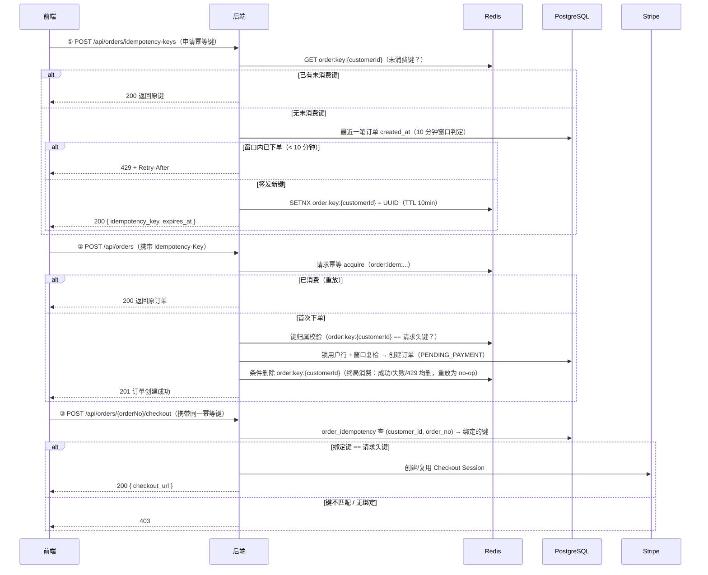

# 订单生成方案：服务端幂等键 + 10 分钟下单窗口 + 支付前幂等校验

## 1. 背景与现状

| 现状（代码事实） | 问题 |
| --- | --- |
| 幂等键由客户端自行生成（`OrderController.placeOrder` 读取 `Idempotency-Key` 请求头）；缺失时服务端按请求内容哈希回退（`OrderServiceImpl.placeOrder` → `requestHash(command)`）；下单失败时请求幂等置 `REJECTED`，同键重试恒 409 | 服务端无法控制键的生成时机与来源；失败重试路径与「键生命周期」耦合，需一并重构（§4.2 步骤 7） |
| 下单接口无频率限制 | 同一用户可连续创建订单（刷单、异常重试、脚本调用） |
| 获取支付链接只需订单号（`OrderController.openCheckout`，路径 `/api/orders/{orderNo}/checkout`），仅校验订单归属 | 知晓订单号且通过认证即可发起支付会话，未与下单主体绑定 |
| 订单创建即 `PENDING_PAYMENT`（`OrderServiceImpl.createOrder`），`expires_at` = 创建时刻 + `paymentTimeoutMinutes`（默认 30 分钟） | 符合目标 3，保持不变 |
| 已有 `order_idempotency` 表：`(customer_id, idempotency_key) → order_no`（唯一约束 `uk_order_idempotency`），Redis + DB 双层幂等 | 可复用作「键 → 订单」的持久绑定，**无需新建表** |
| 已有 Redis 幂等键 `order:idem:{customerId}:{hash(clientKey)}`（`OrderIdempotencyService`，Lua 脚本 SETNX + TTL 600s） | 保留现状，用于请求级重放 |
| CORS 已放行 `Idempotency-Key` 请求头（`SecurityConfig.corsConfigurationSource`） | 新增请求头无需改 CORS |
| 待支付订单超时由 `OrderTimeoutScheduler`（60s 扫描）→ `OrderTimeoutProcessor` 自动取消并回补库存 | 与窗口机制无关，保持独立 |
| Redis 启动时按 `redis.clear-on-startup`（默认 true）flushDb，本地/测试环境键会丢失 | 窗口与绑定的权威来源在 DB；Redis 仅承担签发键与请求幂等的短期状态，见 §10 |

## 2. 目标

1. **下单前必须由后端签发幂等键**，前端持键才能创建订单；键由服务端生成并绑定到当前用户。
2. **单个用户任意 10 分钟滚动窗口内最多生成 1 份订单**（两笔订单的 `created_at` 间隔 ≥ 10 分钟）。
3. **订单生成后默认为待支付状态**（`PENDING_PAYMENT`），超时未支付由现有调度器自动取消。
4. **获取支付链接必须携带该订单的幂等键**，校验通过才能创建/复用 Stripe Checkout 会话。

## 3. 总体流程



**核心原则：三个环节（申请键 → 下单 → 获取支付链接）使用同一个幂等键**，前端在支付完成前不得丢弃它。

## 4. 接口设计

### 4.1 新增：`POST /api/orders/idempotency-keys`（申请/获取下单幂等键）

需登录（`/api/orders/**` 已在 `anyRequest().authenticated()` 内，无需改 SecurityConfig）。

- **请求**：无参数、无请求体。
- **成功 `200`**：

```json
{
  "status": 200,
  "message": "OK",
  "data": {
    "idempotency_key": "6f9d2b7e-1a3c-4d5e-8f0a-9b1c2d3e4f5a",
    "expires_at": "2026-08-01T12:34:56.789Z"
  }
}
```

  `expires_at` = 签发时刻 + 键 TTL（默认 10 分钟），仅作前端展示与提示用，**不是**硬约束（硬约束见 §6 边界 6）。
- **幂等签发**：当前用户已持有未消费键（Redis `order:key:{customerId}` 存在）→ 直接返回原键（`expires_at` 按原键剩余 TTL 计算）。前端重复调用不报错。
- **失败 `429`**：

```json
{
  "status": 429,
  "message": "距上次下单不足 10 分钟，请 5 分 30 秒后再试",
  "data": {}
}
```

  响应头：`Retry-After: 330`（剩余秒数，向上取整）。
- 判定顺序：
  1. Redis `order:key:{customerId}` 已有未消费键 → 返回原键（幂等签发）；
  2. 查 `orders` 该用户最近一笔订单 `created_at`，距今 < 10 分钟 → 429（**UX 预检，非权威**：窗口权威判定在下单事务内，见 §6.2；此步失败仅省一次下单往返）；
  3. 否则生成 UUIDv4（128 位随机熵）→ Redis `SETNX` 原子写入（TTL = 10 分钟）→ 返回。

### 4.2 修改：`POST /api/orders`（创建订单）

**`Idempotency-Key` 请求头由可选改为必填**；删除「缺失时按内容哈希回退」（`OrderServiceImpl.placeOrder` 中的 `?: requestHash(command)` 分支）。

完整校验序列（按顺序；**顺序有讲究，见步骤 2/3 注释**）：

| 步骤 | 校验 | 失败响应 |
| --- | --- | --- |
| 1 | 请求头 `Idempotency-Key` 存在（`@RequestHeader(required = true)`） | `400`（`MissingRequestHeaderException` 现有处理） |
| 2 | **先**走既有请求幂等获取（`OrderIdempotencyService.acquire`，Redis Lua + DB 兜底）：`COMPLETED` → 重放返回原订单；`REJECTED` → `409`；`PENDING` → `409`（现有 `OrderProcessingException`，带 `Retry-After: 1`）；首次（`Acquired`）→ 查 DB 幂等行重放（`replayOrderNo`：同键同内容哈希 → 返回原订单；同键不同哈希 → `409`） | 重放路径**必须**先于键归属校验：下单成功后签发键已删除，若先校验归属，合法重放会被误判 403 |
| 3 | **仅首次创建路径**：键归属校验——Redis `order:key:{customerId}` 存在且值等于请求头键 | 否 → `403 IdempotencyKeyInvalidException`（键非本人签发/已过期/已被消费） |
| 4 | 10 分钟窗口（事务内，用户行锁闸门，见 §6） | `429 OrderWindowLimitException` + `Retry-After` |
| 5 | 创建订单（现状逻辑：校验邮箱/地址/商品/库存 → 快照 → 保存，状态 `PENDING_PAYMENT`，`expires_at` = 创建时刻 + 支付超时） | 见 §4.4 |
| 6 | 既有 `recordOrderNo` 在事务内写 DB 幂等行（键 → 订单持久绑定） | `DataIntegrityViolationException` → 重读重放（现有逻辑） |
| 7 | **终局消费签发键**：所有终局路径（成功、`REJECTED→409`、窗口 `429`、`PENDING→409`、事务内失败）统一条件删除 Redis `order:key:{customerId}`（仅当值仍等于本单键，Lua 原子操作，防误删同用户新键） | 删除失败仅记日志；键过期兜底，不影响订单 |

> **步骤 7 的"终局消费"是刻意的**：
> - **纯重放路径不消费**（步骤 2 返回原订单）——此时键早已被首次成功消费或已被新键替换，条件删除自然为 no-op，不会误删新键（重放与新键共存见 §6.1）。
> - **失败也消费**：库存不足等失败后请求幂等置 `REJECTED`，同键重试恒 409（死循环：申请接口幂等返回旧键）；消费后前端重新申请即得**新键**（失败未创建订单 → 不占窗口 → 立即签发）。acquire 之前的失败（参数/邮箱/地址）虽无 REJECTED，统一按终局消费处理也安全——前端一律「丢弃旧键 → 重新签发」重试（§9 规则 0）。
> - 规则统一后无需区分失败阶段，实现最简单且无正确性死角。

响应（与现状一致，无字段变更）：

- 首次创建：`201 Created`，`data` 含订单完整信息（`status = "PENDING_PAYMENT"`、`expires_at` 等）。
- 重放（同键同内容）：`200 OK`，`data` 为原订单。

### 4.3 修改：`POST /api/orders/{orderNo}/checkout`（获取支付链接）

新增 `Idempotency-Key` 请求头必填 + 绑定校验：

| 步骤 | 校验 | 失败响应 |
| --- | --- | --- |
| 1 | 请求头 `Idempotency-Key` 存在（`@RequestHeader(required = true)`） | `400`（现有 `MissingRequestHeaderException` 处理） |
| 2 | 查 `order_idempotency` 表：`(customer_id, order_no)` 对应的 `idempotency_key` | 无绑定行 / 绑定键 ≠ 请求头键 → `403 IdempotencyKeyInvalidException`（历史订单见 §11） |
| 3 | 通过后走现有 `OrderCheckoutServiceImpl.openCheckout` 逻辑 | — |
| 4 | 订单须为 `PENDING_PAYMENT` 且 `expires_at` 未过（现有 `loadCandidate`） | 现有 `409 OrderStatusException`，不改 |
| 5 | 已绑定 Checkout Session → 复用；否则创建 Stripe 会话并条件绑定（现有并发兜底） | — |

**不需要 acquire 重放前置**：下单成功后 Redis 键已删除，但 DB 绑定行保留——重放请求带同一键 → 步骤 2 绑定匹配 → 直接走 `openCheckout`，而它**天然幂等**（已有 session → `reuseCheckout` 返回同一 URL）。若误加 acquire 前置，`COMPLETED:{orderNo}` 会触发「重放返回原订单」，但 checkout 从未记录过自己的结果，语义错误。

响应 `200` 与现状一致：`{ "order_no", "status": "PENDING_PAYMENT", "checkout_url", "expires_at" }`。

> **校验依据是 DB 幂等行的持久绑定**，而非 Redis 键 TTL。用户持有的键即使过期（10 分钟后），只要绑定存在且订单未超时，仍可正常支付——Redis 只负责「下单前」的键生命周期，DB 负责「下单后」的持久授权。

### 4.4 错误码汇总

| 场景 | 接口 | 状态码 | 响应头 / 说明 |
| --- | --- | --- | --- |
| 窗口内已下单（< 10 分钟） | 申请键 / 创建订单 | `429` | `Retry-After` = 剩余秒数 |
| 键缺失 | 创建订单 / checkout | `400` | 现有 `MissingRequestHeaderException` |
| 键非本人签发 / 已过期 / 已被消费 | 创建订单 | `403` | 新增 `IdempotencyKeyInvalidException` |
| 键与订单绑定不匹配 / 无绑定 | checkout | `403` | 新增 `IdempotencyKeyInvalidException` |
| 同键不同下单内容 | 创建订单 | `409` | 现有 `IdempotencyConflictException` |
| 上次下单仍在处理中 | 创建订单 | `409` | 现有 `OrderProcessingException` + `Retry-After: 1` |
| 订单不存在 / 状态不允许 | 下单 / checkout | `404` / `409` | 现有异常，不改 |
| Redis 不可用（签发键读取/写入失败） | 申请键 / 创建订单 | `503` | 现有 `TransientDataAccessException` 路径，`Retry-After: 1` |

新增异常类（`handler` 包，与现有 `BusinessException` 子类同风格）：

```kotlin
class OrderWindowLimitException(
    message: String = "下单过于频繁，请稍后再试",
    val retryAfterSeconds: Long,
) : BusinessException(HttpStatus.TOO_MANY_REQUESTS, message)

class IdempotencyKeyInvalidException(
    message: String = "幂等键无效或不属于当前用户",
) : BusinessException(HttpStatus.FORBIDDEN, message)
```

- `OrderWindowLimitException` 在 `GlobalExceptionHandler` 加处理器：`builder.status(ex.status).retryAfter(ex.retryAfterSeconds).message(ex.message)`（或复用 `BusinessException` 处理器 + 特判）。
- 无 CORS 改动（`Idempotency-Key` 已在允许列表）；无 SecurityConfig 改动（`/api/orders/**` 已需登录）。

## 5. 数据与存储设计

| 存储 | Key / 表 | 用途 | 生命周期 |
| --- | --- | --- | --- |
| Redis | `order:key:{customerId}` = UUIDv4 | 服务端签发的当前未消费键（下单授权凭证） | SETNX 签发，TTL 10 分钟；下单成功条件删除；未用自动过期 |
| Redis | `order:idem:{customerId}:{sha256(键)}`（现有） | 下单请求级幂等（同键重放去重） | 现有 `idempotencyTtlSeconds`（600s），不变 |
| DB | `order_idempotency`（现有，不新建表） | 键 → 订单持久绑定 + 重放兜底 + checkout 校验依据 | 随订单生命周期保留 |
| DB | `orders` | 10 分钟窗口权威判定 | — |

### 5.1 Redis 操作原语（新增 `OrderIdempotencyKeyService`，复用 `StringRedisTemplate` + Lua）

| 操作 | 语义 | Lua 脚本要点 |
| --- | --- | --- |
| `issue` | 原子签发：SETNX `order:key:{customerId}` = uuid，TTL 10 分钟 | `SET key uuid EX ttl NX`；已存在则返回现值 |
| `consume` | 原子消费：仅当值 == 本单键时删除 | `if GET(key) == ARGV[1] then return DEL(key) else return 0`（防误删同用户新键） |
| `isValidFor` | 校验当前用户的未消费键是否与请求键一致 | `GET` 后精确比较；不存在或已过期均失败 |

- 签发键与下单事务**无原子依赖**：键只是授权凭证，真正的一次性保证由 DB 幂等行（步骤 8）承担；即使 Redis 键删除失败，DB 重放仍保证不重复建单。
- 两个 Redis key 命名空间职责分离：`order:key:` = 签发/授权，`order:idem:` = 请求幂等，互不干扰。
- `redis.clear-on-startup: true`（本地默认）会清空 Redis：签发键丢失 → 用户重新申请即可；已下单的绑定在 DB，不受影响。

### 5.2 DB 变更（增量）

1. **`orders` 索引**：现有 `idx_orders_customer_status (customer_id, status)` 可服务窗口查询（customer_id 前缀 + 少量 created_at 扫描）；**建议新增 `(customer_id, created_at DESC)`**，使「最近一笔订单」查询走索引。
2. **`order_idempotency` 索引**：现有 `uk_order_idempotency (customer_id, idempotency_key)` 服务于重放；checkout 校验需要 `(customer_id, order_no)`，**新增索引** `idx_order_idem_customer_order (customer_id, order_no)`。
3. 两处均为 `@Index` 注解（Hibernate `ddl-auto: update` 自动建索引；生产建议 Flyway 迁移，与现有迁移机制对齐）。

### 5.3 新增 Repository 查询

```kotlin
// OrderIdempotencyRepository（checkout 绑定校验）
fun findByCustomerIdAndOrderNo(customerId: Long, orderNo: String): OrderIdempotency?

// 窗口判定：复用现有 UserRepository.findByIdForUpdate 锁用户行（§6.2），
// 在锁内执行最新订单查询：
fun findByCustomerIdOrderByCreatedAtDesc(customerId: Long, pageable: Pageable): Page<OrderEntity>
//  ↑ OrderRepository 已有此方法（现有），窗口取第一条 createdAt 即可；无需新增查询
```

## 6. 10 分钟窗口：语义、权威闸门与并发

### 6.1 判定规则

- **滚动窗口**：新订单创建时，取该用户最近一笔订单（**任意状态，含 CANCELLED/已超时取消**）的 `created_at`，若 `now - created_at < 10 分钟` → 拒绝。即「两笔订单创建时间间隔 ≥ 10 分钟」。
- **包含已取消订单是刻意取舍**：防止「下单 → 取消 → 再下单」绕过限制刷单。若业务上希望「已取消订单不计窗口」，作为后续可选放宽项（需在 `orders` 加 `cancelReason` 过滤或标记位）。
- **重放豁免**：步骤 2 命中幂等重放（返回原订单）时**不触发**窗口判定——用户重试同一请求不应被窗口拒绝；窗口只约束「新订单的创建」。
- **下单失败豁免**：失败**不生成订单** → 不写 `orders` → 不占窗口。签发键在终局统一消费（§4.2 步骤 7）：前端丢弃旧键、重新签发即可重试（失败未创建订单 → 不占窗口 → 立即签发）。
- **重放与新键共存**：窗口过后用户申请了新键 K2，再拿旧键 K 重放原订单（步骤 2 命中）→ 条件删除只删值 == K 的键，K2 不受影响；新键 K2 保持可用。若 K2 恰为未消费的同一键 → 条件删除精确匹配，语义一致。

### 6.2 并发正确性（关键）

**闸门在数据库事务内，Redis 仅是前置快速通道。** 单机/多实例下「两笔并发下单都通过 Redis 检查」仍可能发生，最终由 DB 串行化：

1. 事务内先执行 `userRepository.findByIdForUpdate(customerId)`（**锁用户行**，与购物车首次创建采用同一模式，`UserRepository` 已有该方法），随后执行窗口查询与订单写入。
   - 用户行锁使同一用户的并发下单请求**串行执行**：第二个事务阻塞，直到第一个事务提交/回滚。
2. 首个事务提交后，第二个事务重读窗口查询 → 看到新订单 → 距创建 < 10 分钟 → 429。
3. 因此**即使前端并发申请多个键、并发发起多笔下单，最终窗口内也只落库 1 笔订单**。
4. 正确性不依赖 Redis（Redis 丢失/重启后，窗口判定仍由 DB 保证）；Redis 仅优化「无历史订单用户」的常见路径。
5. **同键并发重复请求的附带效果**：两笔相同键的并发下单 → 行锁串行化 → 先到者下单并消费键，后到者 acquire 读回 `COMPLETED` → 重放 200（而非 PENDING 409）——体验更好，且无需新增代码。

> 为什么锁用户行而非"锁订单表查询结果"（`SELECT ... FOR UPDATE`）？PostgreSQL 的 `FOR UPDATE` 在没有匹配行时不保证锁住任何东西（无间隙锁），空表/新用户场景下并发穿透。锁用户行语义明确、可复用现有 `findByIdForUpdate`，并顺带串行化「下单失败后重新申请键」等同类操作。

## 7. 键生命周期（时序全景）

| 时刻 | 事件 | `order:key:{customerId}` | `order:idem:{...}` | `order_idempotency` 行 | 用户侧影响 |
| --- | --- | --- | --- | --- | --- |
| T0 | 申请键 | UUID-K（TTL 10min） | — | — | 持键待下单 |
| T0+1min | 再次申请键 | 原键（不变） | — | — | 幂等返回原键 |
| T0+2min | 下单成功 | **删除**（消费） | COMPLETED:K | (user, K → orderNo) | 订单 PENDING_PAYMENT |
| T0+2min | 重复下单（同键） | —（已删） | COMPLETED | 命中 | 重放返回原订单 |
| T0+3min | 申请新键 | 查 DB 窗口：距上次下单 1 分钟 < 10min → **429** | — | — | 倒计时等待 |
| T0+12min | 申请新键 | 窗口已过（11 分钟）→ 签发 UUID-K2 | — | — | 可再次下单 |
| T0+13min | 下单失败（库存不足） | **删除**（终局消费，§4.2 步骤 7） | REJECTED:K2 | 无 | 重新申请键 |
| T0+14min | 申请新键 | 窗口未占用（失败未创建订单）→ 签发 K3 | — | — | 修正后重试 |
| T0+15min | 重试成功 | **删除**（消费） | COMPLETED:K3 | (user, K3 → orderNo2) | 第二笔订单 |
| — | 支付 | checkout 携带 K3 | — | 绑定命中 | 获得 checkout_url |

## 8. 配置项

`application.yaml` 现有 `shopmall.order` 块下新增（env 风格与现有一致）：

```yaml
shopmall:
  order:
    payment-timeout-minutes: "${ORDER_PAYMENT_TIMEOUT_MINUTES:30}"   # 现有，支付超时（订单 expires_at）
    idempotency-ttl-seconds: "${ORDER_IDEMPOTENCY_TTL:600}"          # 现有，请求幂等 TTL
    creation-window-minutes: "${ORDER_CREATION_WINDOW_MINUTES:10}"   # 新增：两笔订单最小间隔
    idempotency-key-ttl-minutes: "${ORDER_KEY_TTL_MINUTES:10}"       # 新增：签发键持有期限（默认与窗口同值）
```

`OrderProperties` 增加两字段，校验：`creation-window-minutes ∈ [1, 1440]`；`idempotency-key-ttl-minutes ∈ [1, 1440]`。

## 9. 前端流程

1. **提交订单**：点击 → `POST /api/orders/idempotency-keys`
   - `200` → 键存入 `sessionStorage`（页面会话内有效，不跨会话泄漏；键绑定用户，切换账号时清空）；
   - `429` → 按钮置灰，展示倒计时「距下次可下单还有 X 分 Y 秒」（`Retry-After` 秒数转倒计时），结束后恢复。
2. **创建订单**：`POST /api/orders`，请求头 `Idempotency-Key: <sessionStorage 中的键>`
   - `201` → 进入待支付页；`200`（重放）→ 视为已成功，跳转原订单；
   - `429` → 同申请接口处理（倒计时）；
   - `403`（键已过期/无效）→ 清掉本地键 → 重新调申请接口 → 回步骤 2（键 10 分钟过期后属正常路径）；
   - `409` → 按 message 展示（`REJECTED` 冲突或上次仍在处理）；
   - 网络异常 → **同一键自动重试**（服务端保证不重复建单）。
   - **规则 0（统一重试）**：**任何终局响应**（`409`/`429`/`403`/网络失败）都意味着服务端已消费该键（§4.2 步骤 7）——清掉本地键 → 重新申请 → 重试。只有 `201`/`200` 是成功终局，不再重试。
3. **去支付**：`POST /api/orders/{orderNo}/checkout`，请求头带**同一键** → 拿 `checkout_url` 跳转 Stripe。
   - **支付完成前不得清除本地键**；支付结果页与 Stripe webhook 回调仍走现有逻辑。
   - checkout 失败（403 等）→ 从 `GET /api/orders/{orderNo}/payment` 或订单详情查状态兜底。
4. **放弃支付**：订单保持待支付，`expires_at` 后由 `OrderTimeoutScheduler` 自动取消并回补库存；用户 10 分钟后可申请新键再下单。
5. **多端**：同账号另一设备申请键 → 返回同一未消费键（键在服务端，跨设备一致）；首笔下单成功后，所有设备进入窗口等待。
6. **键丢失**（关闭浏览器/sessionStorage 被清）：未下单 → 重新申请即可；**已下单**（有绑定行）→ 无法再 checkout（键不匹配 → 403），该订单只能等支付超时自动取消，10 分钟后重新下单。
   - **决策点**：若「下单后键丢失」不能接受（用户关闭浏览器后想回来付款），前端应将键升级为持久存储（localStorage，键绑定用户，登录态判定归属）；代价是键泄漏风险（仅影响自己订单的支付入口，无资金风险）。首版建议 sessionStorage，支付页为单页跳转场景；如要支持「稍后付款」，改 localStorage 仅需改前端一行，服务端无感知。

## 10. 安全考虑

- 键为服务端生成的 UUIDv4（128 位随机熵），不可猜测、不可伪造、不可跨用户复用（三处均校验归属）。
- checkout 键校验后，即使订单号泄露，第三方也无法为用户创建支付会话（订单归属校验之外的第二道防线）。
- 窗口闸门在 DB 事务内，绕过前端直接调 API 无法绕过（§6.2）。
- 日志不记录完整键值（或仅记录哈希）；`OrderIdempotencyKeyService` 复用 `OrderIdempotencyService` 的 SHA-256 哈希工具风格。
- Redis 不可用时申请/下单返回 `503`，**不做「降级放行」**——降级放行会同时绕过窗口闸门与键授权，是安全边界。
- 旧 Redis 数据不构成风险：`order:key:` 命名空间全新；启动清空 Redis（本地）仅使未消费键失效，无订单影响。

## 11. 兼容性影响与过渡

**破坏性变更（本方案落地后）**：

1. `POST /api/orders` 必须携带服务端签发的 `Idempotency-Key`（原可选 + 内容哈希回退被删除）；
2. `POST /api/orders/{orderNo}/checkout` 必须携带该订单的幂等键；
3. **上线前已存在的订单**（含待支付订单）没有键绑定 → checkout 将被 `403` 拒绝。

**过渡建议（二选一）**：

- **平滑过渡**：checkout 校验对「无绑定行的历史订单」放行（按订单 `created_at` < 上线时间判定），新订单严格校验；待支付的历史订单由超时调度器自然清理。
- **直接切换**：内部项目可接受破坏性变更，历史待支付订单在支付超时（≤30 分钟）内由调度器取消。

## 12. 边界与决策记录（ADR）

| # | 决策 | 理由 / 取舍 |
| --- | --- | --- |
| 1 | 签发键放 Redis 而非新表 | 键仅存活于「下单前」阶段，Redis SETNX 天然支持「单用户单键」原子约束；消费后由既有 `order_idempotency` 承担持久绑定，避免冗余表 |
| 2 | 窗口包含已取消/超时订单 | 防「下单→取消→再下单」刷单；放宽（取消不计窗口）留作后续选项 |
| 3 | 窗口权威闸门在 DB 事务内（行锁 + 重读），Redis 仅为前置 | 单机/多实例并发下 Redis 检查不可靠；DB 是最终一致性来源（§6.2） |
| 4 | 重放豁免窗口 | 同键重试是合法用户操作，不应被窗口误伤 |
| 5 | 终局统一消费签发键（成功/失败/429/PENDING 均消费；纯重放不消费，条件删除 no-op） | 失败（库存不足等）后请求幂等为 `REJECTED`，同键重试恒 409；保留旧键会导致申请接口幂等返回旧键 → 死循环。消费后用户重新申请新键，失败未创建订单 → 不占窗口 → 立即签发。统一规则无需区分失败阶段，实现最简单且无正确性死角 |
| 6 | `expires_at` 仅作提示，硬约束是窗口与键归属 | 键过期后用户可重新申请（窗口决定能否下单）；已下单的支付授权由 DB 绑定决定，不受键 TTL 影响 |
| 7 | Redis 不可用 → 503，不降级 | 降级放行同时绕过窗口与键授权（§10） |
| 8 | 键 TTL 默认与窗口同为 10 分钟 | 键的「可下单资格」与窗口语义对齐；两者配置独立可调 |
| 9 | 前端键存 sessionStorage | 键是下单授权凭证，会话级存储平衡持久性与安全；跨设备共享由服务端单键模型天然支持 |
| 10 | 无状态签名键（JWT 式）不采用 | 消费/重放检测仍需要 Redis/DB 状态；状态方案更简单可靠（对比：无状态方案无法实现「单用户单活动键」原子约束） |

## 13. 实施清单（不含代码细节）

1. `OrderIdempotencyKeyService`：issue / consume / peek（Lua 脚本，TTL 可配）；
2. 新增异常 `OrderWindowLimitException`（带 `retryAfterSeconds`）、`IdempotencyKeyInvalidException` + `GlobalExceptionHandler` 映射；
3. 新增签发接口 `POST /api/orders/idempotency-keys`（幂等签发 + 窗口判定 + 429）；
4. `POST /api/orders`：键必填 + 请求幂等重放（步骤 2，现有逻辑位置调整）+ 首次创建路径的键归属校验（步骤 3）+ 窗口事务闸门（步骤 4，锁用户行）+ 终局统一消费键（步骤 7）；删除内容哈希回退；
5. `POST /api/orders/{orderNo}/checkout`：键绑定校验（**不**做 acquire 重放前置，见 §4.3 注）；
6. `OrderIdempotencyRepository.findByCustomerIdAndOrderNo`；窗口查询复用现有 `findByCustomerIdOrderByCreatedAtDesc` + 既有 `UserRepository.findByIdForUpdate`（无需新查询）；
7. 实体索引：`orders (customer_id, created_at DESC)`、`order_idempotency (customer_id, order_no)`；
8. `OrderProperties` + `application.yaml` 新增配置；
9. 前端：申请键、sessionStorage 持久化、429 倒计时、持键下单/支付、失败重试；
10. 测试：签发幂等、窗口 429（含并发双请求仅一单）、键归属 403、checkout 绑定校验（含重放 200 不被误拦）、终局消费（成功/失败/429 均消费键，纯重放 no-op 不误删新键）、键丢失后的 checkout 403 行为。
