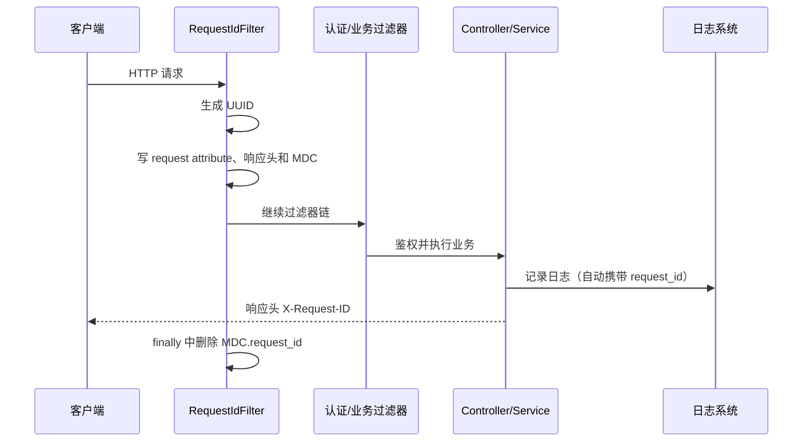

# HTTP 请求 ID 设计方案

## 1. 目标与边界

为每个进入 ShopMall Servlet 过滤器链的 HTTP 请求生成一个工程意义上唯一的请求 ID，并满足：

1. 同一个请求在 Controller、Service、Repository 和全局异常处理器的日志中使用同一个 ID。
2. 无论请求成功，还是返回 `401`、`403`、`404`、`413`、`500`，响应头都包含该 ID。
3. 两次独立的 HTTP 请求，即使 URL、用户和请求体完全相同，也得到不同的 ID。
4. 请求结束后清理线程上下文，避免 Servlet 线程复用时把上一个请求的 ID 带到下一个请求。
5. 前端可以从跨域响应中读取该 ID，以便用户报错时提供给服务端检索日志。

这里的“每个请求”指已经进入应用 Servlet 过滤器链的请求。TLS 握手失败、HTTP 报文格式错误、连接器在过滤器执行前拒绝的请求，只能由网关或 Web 容器生成和记录 ID，应用代码无法覆盖。

## 2. 核心决策

| 项目 | 决策 | 原因 |
| --- | --- | --- |
| 响应头 | `X-Request-ID` | 不改变现有统一响应体，也能覆盖无响应体、Security 和过滤器提前返回的情况 |
| 日志字段 | MDC 的 `request_id` | 业务代码不必在每条日志中手工传入请求 ID |
| 生成算法 | 服务端 `UUID.randomUUID()` | JDK 自带、无共享状态，UUID v4 的 122 位随机空间足以满足请求日志关联需求 |
| 客户端传入值 | 忽略并重新生成 | 防止客户端复用、伪造超长值或注入日志，从入口保证每次请求获得新 ID |
| 响应体 | 不增加 `request_id` | 避免修改 `shared.Response` 和所有 Controller；响应头已适用于成功与失败响应 |
| 数据库存储 | 不存储 | 请求 ID 是短期诊断上下文，不是业务主键；需要时由日志平台索引 |

UUID v4 的唯一性是概率保证，不是数学上的绝对保证。它发生碰撞的概率在本项目流量规模下可以忽略；无需为日志关联引入数据库序列或 Redis 发号器。

## 3. 请求生命周期



必须在调用 `filterChain.doFilter` **之前**写响应头。这样 `SupportTicketUploadSizeFilter` 提前返回 `413`、Spring Security 返回 `401/403` 或全局异常处理器返回 `500` 时，响应仍带有请求 ID。

## 4. 后端实现

新增文件：

`src/main/kotlin/top/foxball/shopmall/config/RequestIdFilter.kt`

```kotlin
package top.foxball.shopmall.config

import jakarta.servlet.FilterChain
import jakarta.servlet.http.HttpServletRequest
import jakarta.servlet.http.HttpServletResponse
import org.slf4j.MDC
import org.springframework.core.Ordered
import org.springframework.core.annotation.Order
import org.springframework.stereotype.Component
import org.springframework.web.filter.OncePerRequestFilter
import java.util.UUID

@Component
@Order(Ordered.HIGHEST_PRECEDENCE)
class RequestIdFilter : OncePerRequestFilter() {
    override fun doFilterInternal(
        request: HttpServletRequest,
        response: HttpServletResponse,
        filterChain: FilterChain,
    ) {
        val requestId = UUID.randomUUID().toString()

        request.setAttribute(ATTRIBUTE_NAME, requestId)
        response.setHeader(HEADER_NAME, requestId)
        MDC.put(MDC_KEY, requestId)

        try {
            filterChain.doFilter(request, response)
        } finally {
            MDC.remove(MDC_KEY)
        }
    }

    companion object {
        const val HEADER_NAME = "X-Request-ID"
        const val ATTRIBUTE_NAME = "request_id"
        const val MDC_KEY = "request_id"
    }
}
```

实现要点：

- `@Order(Ordered.HIGHEST_PRECEDENCE)` 使其早于当前顺序为 `HIGHEST_PRECEDENCE + 10` 的 `SupportTicketUploadSizeFilter`。
- 使用 `setHeader` 而不是 `addHeader`，确保响应中只有一个 `X-Request-ID`。
- 必须在 `finally` 中调用 `MDC.remove(MDC_KEY)`，保证业务异常时也会清理。
- 不要调用 `MDC.clear()`，否则可能误删链路追踪等其他组件写入的 MDC 字段。
- 不需要修改 Controller、`GlobalExceptionHandler` 或 `ResponseBuilder`。现有 `LoggerFactory` 日志会自动读取 MDC。

如果业务代码确实需要读取当前请求 ID，可以从当前 `HttpServletRequest` 的 `request_id` attribute 获取；不要把它加入每个 Controller 的方法参数，也不要把它当作业务字段向下传递。

## 5. 日志格式

在 `src/main/resources/application.yaml` 增加：

```yaml
logging:
  pattern:
    level: "%5p [request_id=%X{request_id:-none}]"
```

请求线程中的日志示例：

```text
2026-08-06T21:30:12.345 INFO [request_id=9020c8b8-5127-4944-9870-c0c108e314e1] ...
```

启动日志、定时任务等不属于 HTTP 请求的日志会显示 `request_id=none`。如果生产环境改用 JSON 日志，应保留独立的 `request_id` 字段，而不是只把它拼进 `message`。

## 6. CORS 与前端读取

浏览器只允许 JavaScript 读取 CORS 安全响应头或 `Access-Control-Expose-Headers` 中声明的响应头。将 `SecurityConfig.corsConfigurationSource()` 中的配置改为：

```kotlin
exposedHeaders = listOf("Retry-After", "X-Request-ID")
```

不需要把 `X-Request-ID` 加入 `allowedHeaders`，因为当前方案不接受客户端传入该请求头。

前端使用 `fetch` 时可读取：

```typescript
const response = await fetch(url, options)
const requestId = response.headers.get("X-Request-ID")
```

前端应在错误提示或错误上报中保留该值，但不要把它作为重试标识。一次重试是一个新 HTTP 请求，因此必须获得新的请求 ID。

## 7. 测试方案

新增单元测试：

`src/test/kotlin/top/foxball/shopmall/config/RequestIdFilterTest.kt`

```kotlin
package top.foxball.shopmall.config

import jakarta.servlet.FilterChain
import org.slf4j.MDC
import org.springframework.mock.web.MockHttpServletRequest
import org.springframework.mock.web.MockHttpServletResponse
import java.util.UUID
import kotlin.test.Test
import kotlin.test.assertEquals
import kotlin.test.assertFailsWith
import kotlin.test.assertNotEquals
import kotlin.test.assertNull

class RequestIdFilterTest {
    private val filter = RequestIdFilter()

    @Test
    fun `each request receives a different server generated id`() {
        val firstResponse = MockHttpServletResponse()
        val secondResponse = MockHttpServletResponse()

        filter.doFilter(
            MockHttpServletRequest("GET", "/api/products"),
            firstResponse,
            FilterChain { _, _ -> },
        )
        filter.doFilter(
            MockHttpServletRequest("GET", "/api/products"),
            secondResponse,
            FilterChain { _, _ -> },
        )

        val firstId = firstResponse.getHeader(RequestIdFilter.HEADER_NAME)
        val secondId = secondResponse.getHeader(RequestIdFilter.HEADER_NAME)
        UUID.fromString(firstId)
        UUID.fromString(secondId)
        assertNotEquals(firstId, secondId)
    }

    @Test
    fun `request id is available in mdc and removed after completion`() {
        val response = MockHttpServletResponse()
        var requestIdInsideChain: String? = null

        filter.doFilter(
            MockHttpServletRequest("GET", "/api/products"),
            response,
            FilterChain { _, _ -> requestIdInsideChain = MDC.get(RequestIdFilter.MDC_KEY) },
        )

        assertEquals(response.getHeader(RequestIdFilter.HEADER_NAME), requestIdInsideChain)
        assertNull(MDC.get(RequestIdFilter.MDC_KEY))
    }

    @Test
    fun `mdc is removed when downstream throws`() {
        val response = MockHttpServletResponse()

        assertFailsWith<IllegalStateException> {
            filter.doFilter(
                MockHttpServletRequest("GET", "/api/products"),
                response,
                FilterChain { _, _ -> throw IllegalStateException("failed") },
            )
        }

        assertNull(MDC.get(RequestIdFilter.MDC_KEY))
    }

    @Test
    fun `client supplied id is ignored`() {
        val request = MockHttpServletRequest("GET", "/api/products").apply {
            addHeader(RequestIdFilter.HEADER_NAME, "client-controlled-id")
        }
        val response = MockHttpServletResponse()

        filter.doFilter(request, response, FilterChain { _, _ -> })

        assertNotEquals(
            "client-controlled-id",
            response.getHeader(RequestIdFilter.HEADER_NAME),
        )
    }
}
```

再使用带完整过滤器链的集成测试验证以下响应。项目中大量 Controller 测试使用 `MockMvcBuilders.standaloneSetup`，它不会自动加载 `@Component` 过滤器；这类测试必须显式 `.addFilters(RequestIdFilter())`，或者另写一个加载 Spring 上下文的 MockMvc 测试。

| 场景 | 预期 |
| --- | --- |
| 正常公开接口 `200` | 响应有合法 UUID 格式的 `X-Request-ID` |
| 未认证请求 `401` | 响应仍有 `X-Request-ID` |
| 无权限请求 `403` | 响应仍有 `X-Request-ID` |
| 不存在的资源 `404` | 响应仍有 `X-Request-ID` |
| 工单上传过大 `413` | 响应仍有 `X-Request-ID` |
| 未处理异常 `500` | 响应仍有 `X-Request-ID`，异常日志含相同 `request_id` |
| 连续发送两次相同请求 | 两个 ID 不同 |
| 客户端伪造 `X-Request-ID` | 响应值与伪造值不同 |

## 8. 异步任务与下游服务

当前项目未使用 `@Async`、`Callable` 或 `DeferredResult`，上述 MDC 方案可以覆盖现有同步 Spring MVC 调用链。以后引入线程池异步执行时，MDC 不会自动跨线程传播；需要为执行器配置 `TaskDecorator`，复制 MDC context map，并在任务结束时恢复或清理工作线程上下文。

定时任务、Redis Stream 消费和 Outbox Relay 不是某个 HTTP 请求的延续，不应复用已经结束的请求 ID。它们应记录自身稳定的业务标识，例如 `order_no`、事件 ID 或任务执行 ID。

如果以后拆分微服务，不要让 `X-Request-ID` 同时承担分布式链路追踪职责：

- `request_id`：每个服务收到的每次请求都不同，用于定位单次服务调用。
- `trace_id`：同一条跨服务调用链共享，使用 W3C `traceparent` 和 Micrometer Tracing/OpenTelemetry。
- `Idempotency-Key`：业务重试可以复用，用于防止重复产生业务结果。

三者生命周期和安全语义不同，不能互相替代。

## 9. 实施顺序与验收标准

1. 新增 `RequestIdFilter` 及其单元测试。
2. 配置日志 pattern，使现有日志自动带 `request_id`。
3. 在 CORS `exposedHeaders` 中加入 `X-Request-ID`。
4. 增加覆盖 Security、提前返回和异常响应的完整过滤器链测试。
5. 前端错误上报读取并保存 `X-Request-ID`。

完成标准：任意进入应用过滤器链的请求都获得一个由服务端新生成的 UUID；响应头、该请求期间的服务端日志和前端错误记录可以用同一个值关联，同时请求结束后 MDC 中不残留该值。
