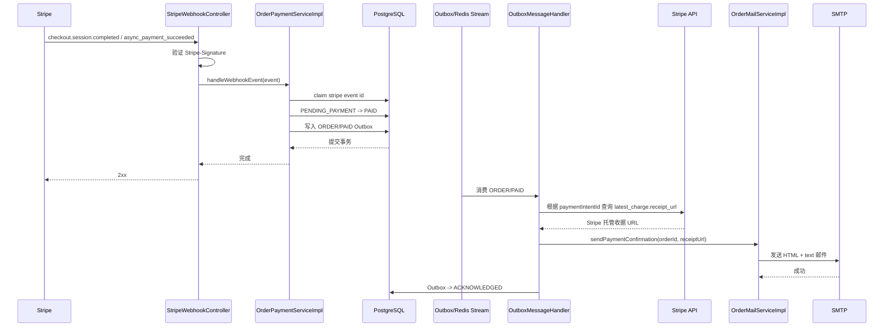

# Stripe 收款完成后自动发送订单支付完成邮件设计

> 文档状态：实施方案
> 适用范围：ShopMall 后端
> 目标：服务端收到并成功处理 Stripe 收款完成 Webhook 后，自动向下单用户发送订单支付完成邮件，并在邮件中提供 Stripe 托管收据链接。

## 1. 需求定义

### 1.1 业务目标

当 Stripe 确认 Checkout 订单已经完成收款时：

1. 验证 Stripe Webhook 签名；
2. 幂等地把本地订单从 `PENDING_PAYMENT` 更新为 `PAID`；
3. 在同一个数据库事务中写入订单已支付 Outbox 事件；
4. 事务提交后，由现有 Outbox/Redis Stream 消费链路发送支付完成邮件；
5. 邮件同时包含：
   - ShopMall 订单号、商品、金额、收货地址和支付时间；
   - ShopMall 客户订单页链接；
   - Stripe 托管收据链接（Stripe `Charge.receipt_url`）。

### 1.2 “Stripe 订单链接”的口径

本需求中的 Stripe 链接应实现为 **Stripe 托管收据链接**，即 `Charge.receipt_url`，而不是 Checkout Session 的 `url`。

原因：

- Checkout Session 的 `url` 是支付页面地址，主要用于支付前跳转；支付完成后不适合作为用户查看付款凭证的稳定入口；
- Stripe 的订单对象并不是本项目的业务订单，项目订单与 Stripe 的核心关联是 `Checkout Session -> PaymentIntent -> Charge`；
- `Charge.receipt_url` 是由 Stripe 托管、面向付款人的收据页面，最符合“附上 Stripe 的订单/付款链接”的业务语义。

若产品最终明确要求的是 Stripe Dashboard 内部链接，则不能发送给客户：Dashboard 地址通常要求商户 Stripe 账号权限，只适合管理端运营人员使用。

## 2. 当前代码现状

项目已经具备绝大部分基础链路：

```text
Stripe
  -> POST StripeProperties.WEBHOOK_PATH
  -> StripeWebhookController（验签、限制请求体大小）
  -> OrderPaymentServiceImpl.handleWebhookEvent
  -> checkout.session.completed / checkout.session.async_payment_succeeded
  -> markPaid
  -> 本地订单更新为 PAID
  -> 写入 domain_outbox：aggregateType=ORDER, eventType=PAID
  -> OutboxRelayScheduler
  -> Redis Stream
  -> OrderEventConsumer
  -> OutboxMessageHandler
  -> OrderMailService.sendPaymentConfirmation(orderId)
  -> JavaMailSender
```

已有实现文件：

- `src/main/kotlin/top/foxball/shopmall/controller/StripeWebhookController.kt`
- `src/main/kotlin/top/foxball/shopmall/service/impl/OrderPaymentServiceImpl.kt`
- `src/main/kotlin/top/foxball/shopmall/service/impl/OutboxRelayScheduler.kt`
- `src/main/kotlin/top/foxball/shopmall/service/impl/OrderEventConsumer.kt`
- `src/main/kotlin/top/foxball/shopmall/service/impl/OutboxMessageHandler.kt`
- `src/main/kotlin/top/foxball/shopmall/service/OrderMailService.kt`
- `src/main/kotlin/top/foxball/shopmall/service/impl/OrderMailServiceImpl.kt`
- `src/main/resources/templates/mail/order-payment-confirmation.html`

当前 `PAID` 事件已能触发付款成功邮件，但邮件只包含客户订单页 `.../account/orders`，还没有 Stripe 托管收据链接。因此本次工作应当在现有可靠异步链路上增量实现，不应在 Webhook Controller 中同步调用 SMTP。

## 3. 推荐设计

### 3.1 总体原则

- **Webhook 只负责确认支付并提交可靠事件**，不直接发送邮件；
- **订单状态和 Outbox 事件原子提交**，避免订单已经支付但通知任务丢失；
- **Stripe API 查询和 SMTP 调用位于事务外**，避免第三方网络延迟占用订单事务；
- **重复 Webhook 不生成重复 `PAID` 事件**；
- **只给真正推进为 `PAID` 的订单发邮件**；取消订单收到迟到付款、随后自动退款的冲突流程不能发送普通“支付完成”邮件；
- Stripe 收据链接不可用时，应按明确的异常策略处理，不能静默把错误链接发给用户。

### 3.2 推荐数据流



## 4. 详细改造方案

### 4.1 在 Stripe 适配层提供收据链接查询能力

修改：

- `src/main/kotlin/top/foxball/shopmall/service/payMent/stripe/StripeService.kt`

新增一个语义明确的方法，例如：

```kotlin
fun retrieveReceiptUrl(paymentIntentId: String): String
```

推荐实现步骤：

1. 使用 `PaymentIntentRetrieveParams` 查询 PaymentIntent；
2. 展开 `latest_charge`：

```kotlin
val params = PaymentIntentRetrieveParams.builder()
    .addExpand("latest_charge")
    .build()
```

3. 通过现有 `stripeCall { ... }` 包装 Stripe SDK 调用，使认证、限流、网络故障等继续映射为项目统一的 `PaymentProviderException`；
4. 从 `paymentIntent.latestChargeObject?.receiptUrl` 取得链接；
5. 若 `latest_charge` 或 `receipt_url` 为空，抛出带订单支付语义的异常，不要拼接猜测性的 Stripe URL。

示意代码：

```kotlin
fun retrieveReceiptUrl(paymentIntentId: String): String {
    val paymentIntent = stripeCall {
        stripeClient.v1().paymentIntents().retrieve(
            paymentIntentId,
            PaymentIntentRetrieveParams.builder()
                .addExpand("latest_charge")
                .build(),
        )
    }
    return paymentIntent.latestChargeObject?.receiptUrl
        ?.takeIf(String::isNotBlank)
        ?: throw IllegalStateException(
            "Stripe PaymentIntent $paymentIntentId does not expose a receipt URL",
        )
}
```

实现时应根据项目当前使用的 `stripe-java 33.1.1` 实际方法签名调整，但不要绕过已有 `StripeClient` 和 `stripeCall`。

### 4.2 扩展订单邮件服务输入

修改：

- `src/main/kotlin/top/foxball/shopmall/service/OrderMailService.kt`
- `src/main/kotlin/top/foxball/shopmall/service/impl/OrderMailServiceImpl.kt`

建议把接口改为：

```kotlin
fun sendPaymentConfirmation(orderId: Long, stripeReceiptUrl: String)
```

不建议让 `OrderMailServiceImpl` 自己查询 Stripe，原因是：

- 邮件服务应负责组装和投递邮件，不应承担支付渠道查询职责；
- `StripeService` 已是支付渠道适配层；
- 在 `OutboxMessageHandler` 中编排“查询收据 -> 发邮件 -> ACK”更容易看清失败边界；
- 将来更换邮件模板或支付渠道时职责更清晰。

在邮件发送前必须校验链接：

```kotlin
val receiptUri = URI(stripeReceiptUrl)
require(receiptUri.scheme == "https") { "Stripe receipt URL must use HTTPS" }
```

如果要进一步限制主机名，应允许 Stripe 实际使用的托管收据域名，不要仅硬编码一个未经验证的域名。无论是否限制主机，模板插值前都必须继续使用 `HtmlUtils.htmlEscape`。

### 4.3 在 Outbox 消费者中查询并传递 Stripe 收据链接

修改：

- `src/main/kotlin/top/foxball/shopmall/service/impl/OutboxMessageHandler.kt`

为 `OutboxMessageHandler` 注入：

- `OrderRepository`
- `StripeService`

`ORDER/PAID` 分支建议执行：

```kotlin
"PAID" -> {
    val order = orderRepository.findById(aggregateId).orElseThrow {
        IllegalStateException("Cannot send payment confirmation for missing order $aggregateId")
    }
    check(order.status == OrderStatus.PAID) {
        "Cannot send payment confirmation for order ${order.orderNo} in status ${order.status}"
    }
    val paymentIntentId = requireNotNull(order.paymentIntentId) {
        "Paid order ${order.orderNo} has no Stripe PaymentIntent"
    }
    val receiptUrl = stripeService.retrieveReceiptUrl(paymentIntentId)
    orderMailService.sendPaymentConfirmation(aggregateId, receiptUrl)
}
```

执行成功后，沿用当前逻辑把 Outbox 标记为 `ACKNOWLEDGED`；任一步骤抛出异常时不要 ACK，由 `OrderEventConsumer` 调用 `recordFailure`，按现有退避规则重试，达到最大次数后进入 `NEEDS_REPLAY`。

### 4.4 保证 Webhook 中先绑定 PaymentIntent 再产生 PAID 事件

当前 `handleCheckoutEvent` 已在 `markPaid` 前调用：

```kotlin
session.paymentIntent?.let {
    orderRepository.attachPaymentIntentToStripeCheckoutSession(sessionId, it)
}
```

需要保留这一顺序，并补充测试确认：

- `checkout.session.completed` 且 `payment_status=paid` 时先绑定 PaymentIntent，再更新为 `PAID`；
- `checkout.session.async_payment_succeeded` 同样产生 `PAID` 事件；
- `checkout.session.completed` 但尚未 paid 时不发送邮件，等待异步支付成功事件；
- 订单已是 `PAID` 时，重复回调不再创建第二个 `PAID` Outbox；
- 订单已取消但发生迟到支付时只进入冲突退款流程，不创建普通支付完成邮件事件。

### 4.5 更新 HTML 和纯文本邮件模板

修改：

- `src/main/resources/templates/mail/order-payment-confirmation.html`
- `src/main/kotlin/top/foxball/shopmall/service/impl/OrderMailServiceImpl.kt`

保留现有 “View my order” 按钮，并增加第二个链接，例如：

```html
<a href="{{stripe_receipt_url}}" target="_blank" rel="noopener noreferrer">
  View Stripe receipt ↗
</a>
```

模板替换增加：

```kotlin
"{{stripe_receipt_url}}" to HtmlUtils.htmlEscape(stripeReceiptUrl)
```

纯文本邮件增加：

```text
View your order: https://shop.example/account/orders
View Stripe receipt: https://pay.stripe.com/receipts/...
```

推荐文案：

- 邮件主题：保持现有 `PELISSA | Payment received · {orderNo}`；
- 主按钮：`View my order`；
- 次按钮或文本链接：`View Stripe receipt`；
- 提示：`The Stripe receipt link is hosted securely by Stripe.`

不要在日志中输出完整 `receipt_url`。该 URL 虽然不是商户密钥，但属于面向付款人的访问链接，日志只记录订单号、PaymentIntent ID 和异常摘要即可。

## 5. 幂等、事务与失败处理

### 5.1 Webhook 幂等

现有 `StripeWebhookEventRepository.claim(event.id, event.type)` 用于占有 Stripe 事件；同时 `markPaid` 使用条件更新：

```text
PENDING_PAYMENT -> PAID
```

只有更新成功的第一次处理才写入 `PAID` Outbox，因此重复的相同事件或重复的支付成功通知不会重复创建邮件任务。该行为应保留。

### 5.2 邮件投递语义

现有 Outbox 消费属于 **至少一次执行**：如果 SMTP 已接受邮件，但应用在写入 `ACKNOWLEDGED` 前崩溃，重试可能再次发送邮件。这是当前架构下无法完全排除的窗口。

本需求范围内建议：

- 继续复用当前 Outbox 重试机制；
- 邮件主题和正文固定包含订单号，便于用户识别；
- 不新增数据库迁移或新的邮件投递表，因为项目约定数据库迁移不在默认范围内。

如果业务要求“严格最多发送一次”，需另行设计持久化通知幂等记录、邮件提供商幂等键或可查询的投递状态；这属于后续独立需求。

### 5.3 Stripe 查询失败

| 场景 | 处理 |
|---|---|
| Stripe 超时、连接失败、限流或 5xx | 抛出异常，不 ACK；由 Outbox 重试 |
| PaymentIntent 不存在或认证失败 | 抛出异常；最终进入 `NEEDS_REPLAY`，由运营修复配置或数据后重放 |
| `latest_charge` 暂时为空 | 不发缺少收据链接的邮件，先重试 |
| `receipt_url` 为空 | 不拼接假链接；记录错误并重试/进入人工重放 |
| SMTP 发送失败 | 抛出异常，不 ACK；沿用 Outbox 重试 |
| 订单或用户不存在 | 视为数据一致性错误，不 ACK，最终进入人工处理 |

### 5.4 为什么不能在 Webhook Controller 里直接发邮件

如果在 Stripe Webhook 请求线程中同步调用 SMTP：

- SMTP 慢或失败会拖慢 Webhook 响应，导致 Stripe 重试；
- 邮件失败可能导致已成功支付的本地事务回滚或重复处理；
- 第三方服务的两个故障域被强耦合；
- 难以复用现有 Outbox 的退避、重放和监控能力。

因此应保持 `Stripe Webhook -> 数据库事务 -> Outbox -> 邮件` 的结构。

## 6. 配置

项目已有：

```dotenv
MAIL_HOST=
MAIL_PORT=587
MAIL_USERNAME=
MAIL_PASSWORD=
MAIL_FROM=
```

以及：

```yaml
shopmall:
  mail:
    order:
      from: "${MAIL_FROM:}"
      subject-prefix: "${ORDER_MAIL_SUBJECT_PREFIX:PELISSA}"
```

建议在 `.env.example` 增加订单邮件主题配置说明：

```dotenv
# 订单支付完成邮件；留空时使用默认品牌名 PELISSA
ORDER_MAIL_SUBJECT_PREFIX=PELISSA
```

无需新增 Stripe 收据基础 URL 配置：收据 URL 必须由 Stripe API 返回，不能由本地配置拼接。

## 7. 测试计划

### 7.1 `OrderPaymentServiceImplTest`

补充或强化：

1. `checkout.session.completed + paid`：
   - 绑定 `paymentIntentId`；
   - `markPaid` 成功；
   - 只发布一次 `ORDER/PAID`。
2. `checkout.session.completed + unpaid`：不发布 `PAID`。
3. `checkout.session.async_payment_succeeded`：发布 `PAID`。
4. 重复事件 claim 失败：不修改订单、不发 Outbox。
5. 已支付订单再次收到成功事件：不发布第二个 `PAID`。
6. 已取消订单迟到支付：只发布 `PAYMENT_CONFLICT_REFUND`。

### 7.2 `OutboxMessageHandlerTest`

修改现有 “paid order email is delegated before outbox acknowledgement” 测试：

- 准备带 `paymentIntentId` 的 `PAID` 订单；
- mock `stripeService.retrieveReceiptUrl("pi_...")`；
- 验证 `sendPaymentConfirmation(orderId, receiptUrl)`；
- 验证邮件服务成功后才写 `ACKNOWLEDGED`；
- Stripe 查询异常时不 ACK；
- SMTP/邮件服务异常时不 ACK；
- 缺少 PaymentIntent 时抛出异常且不 ACK。

### 7.3 `OrderMailServiceImplTest`

在现有 HTML 转义和纯文本断言基础上增加：

- HTML 中包含转义后的 `{{stripe_receipt_url}}`；
- 纯文本中包含 `View Stripe receipt:`；
- 模板渲染后不残留 `{{...}}`；
- 非 HTTPS 或非法 URI 被拒绝；
- 收件人、发件人、主题和原订单页链接保持不变。

### 7.4 `StripeService` 单元测试

新增 Stripe 收据查询测试（可通过 mock Stripe Client/service 层完成）：

- 展开 `latest_charge` 后返回 `receipt_url`；
- `latest_charge` 为空时失败；
- `receipt_url` 为空时失败；
- Stripe 网络异常继续映射成可重试的 `PaymentProviderException`；
- Stripe 认证或 PaymentIntent 不存在映射成不可重试的提供商错误，但 Outbox 仍保留为人工重放状态。

### 7.5 回归命令

```powershell
.\gradlew.bat test --tests "top.foxball.shopmall.service.payment.OrderPaymentServiceImplTest"
.\gradlew.bat test --tests "top.foxball.shopmall.service.OutboxMessageHandlerTest"
.\gradlew.bat test --tests "top.foxball.shopmall.service.OrderMailServiceImplTest"
.\gradlew.bat test
```

## 8. 验收标准

- [ ] Stripe `checkout.session.completed` 且 `payment_status=paid` 后，订单仅被推进一次为 `PAID`。
- [ ] 异步支付方式通过 `checkout.session.async_payment_succeeded` 后也会触发邮件。
- [ ] Webhook 在本地事务成功后及时返回 2xx，不等待 Stripe API 二次查询或 SMTP。
- [ ] 用户收到的支付完成邮件包含正确的订单号、金额、商品、地址和支付时间。
- [ ] 邮件同时包含 ShopMall 订单页链接和 Stripe `Charge.receipt_url`。
- [ ] 邮件的 HTML 与纯文本版本都包含 Stripe 收据链接。
- [ ] 重复 Webhook 不创建重复 `PAID` 事件。
- [ ] Stripe 或 SMTP 暂时失败时 Outbox 不被 ACK，并按照现有策略重试。
- [ ] 取消订单的迟到付款不会误发普通支付完成邮件。
- [ ] 日志不输出 Stripe Secret、Webhook Secret 或完整收据 URL。
- [ ] 全量后端测试通过。

## 9. 预计修改文件

```text
src/main/kotlin/top/foxball/shopmall/service/payMent/stripe/StripeService.kt
src/main/kotlin/top/foxball/shopmall/service/OrderMailService.kt
src/main/kotlin/top/foxball/shopmall/service/impl/OrderMailServiceImpl.kt
src/main/kotlin/top/foxball/shopmall/service/impl/OutboxMessageHandler.kt
src/main/resources/templates/mail/order-payment-confirmation.html
src/test/kotlin/top/foxball/shopmall/service/payment/OrderPaymentServiceImplTest.kt
src/test/kotlin/top/foxball/shopmall/service/OutboxMessageHandlerTest.kt
src/test/kotlin/top/foxball/shopmall/service/OrderMailServiceImplTest.kt
.env.example
```

本方案不需要新增 Controller API，不涉及 `AdminPanelUI/` 或 `frontend/` 页面改动，也不创建或修改数据库迁移脚本。

## 10. 实施顺序

1. 在 `StripeService` 增加根据 PaymentIntent 获取托管收据 URL 的能力；
2. 扩展 `OrderMailService` 参数，并更新 HTML/纯文本模板；
3. 在 `OutboxMessageHandler` 的 `ORDER/PAID` 分支查询收据并发送邮件；
4. 更新单元测试；
5. 使用 Stripe CLI 发送测试 Webhook，结合测试模式 PaymentIntent 验证实际收据链接；
6. 验证 SMTP 投递、Outbox ACK、失败重试和 `NEEDS_REPLAY` 行为。
